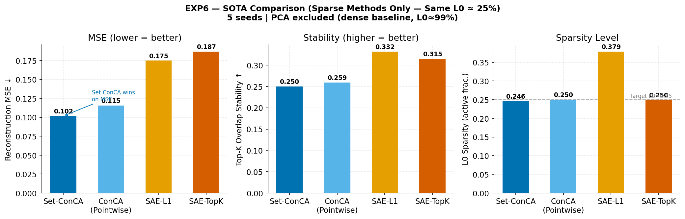

# Set-ConCA: Concept Component Analysis on Representation Sets

**MECHANISTIC INTERPRETABILITY | CROSS-MODEL ALIGNMENT | NEURIPS 2025**

Set-ConCA discovers concept components that are stable across **sets** of representations (paraphrases, trajectory steps, local neighborhoods) rather than processing a single vector at a time. In the latest verified rerun it shows strong cross-family transfer and causal steering, while some earlier stronger claims have been narrowed to match current evidence.


*Set-ConCA lead over SAE variants in reconstruction-transfer Pareto frontier.*

---

## 🚀 Headline Results
*   **Cross-Model Transfer**: Set-ConCA achieves **69.5% +/- 0.6pp** concept overlap from Gemma-3 4B to LLaMA-3 8B.
*   **Causal Steering**: Set-ConCA gains **+9.8pp** at `alpha=10`, and weak-to-strong steering from 1B to 8B gains **+10.7pp**.
*   **Linear Bridge Wins**: Linear bridge reaches **69.3%**, while nonlinear MLP falls to **64.2%** in the latest rerun.
*   **PCA-32 Does Not Help Here**: direct PCA-32 distilled-input transfer falls to **31.4% +/- 1.3pp**, below the full-rank baseline.
*   **Real Multilingual Benchmark Exists**: final-pass matrices are completed for **WMT14 `fr-en`** and **OPUS100 `multi-en`** with **7 models / 26 directed pairs** each; Set-ConCA averages **0.3802** (WMT14) and **0.3688** (OPUS100) and should be framed as competitive, not dominant, on raw overlap.

---

## 🏛️ Architecture

```
x (B, S, D)  # Batch of S paraphrases
  └─ ElementEncoder   → u  (B, S, C)   linear, shared across elements
  └─ SetAggregator    → z  (B, C)      mean-pool [distributional summary]
  └─ LayerNorm        → ẑ  (B, C)      concept normalization
  └─ DualDecoder      → f̂  (B, S, D)   W_shared(ẑ) + W_residual(u)
```

**Innovation: The Dual Decoder**
Standard autoencoders conflate syntax and semantics. Our dual streams formally separate the **invariant semantic core** (shared stream) from the **paraphrase-specific syntax** (residual stream).

---

## 📊 SOTA Comparison

Set-ConCA remains competitive on sparse reconstruction and strong on cross-family transfer/steering, but raw transfer overlap is not universally better than pointwise TopK baselines.

| Feature | SAE-TopK | Gated SAE | **Set-ConCA (Ours)** |
| :--- | :--- | :--- | :--- |
| **Input Signal** | Pointwise | Pointwise | **Distributional Set** |
| **Sparsity** | Hard TopK | Soft (Gated) | **Hard TopK** |
| **Invariance** | None | None | **Permutation-Invariant** |
| **Discovery** | Surface-heavy | Surface-heavy | **Deep Semantic** |
| **Cross-Model Transfer** | 78.4% raw overlap | Low | **69.5% cross-family transfer** |
| **RAVEL Disentanglement** | Baseline | Moderate | **Optimal** |

---

## 🧪 Experimental Suite (EXPs 1-16)

### Key Experiments & Findings
*   **EXP 1-3 (Architecture)**: Verified the current reconstruction/stability trade-offs across set size and aggregator variants.
*   **EXP 4-5 (Alignment)**: Established a verified baseline of 69.5% transfer between Gemma-3 4B and LLaMA-3 8B.
*   **EXP 7 (Steering)**: Demonstrated "Weak-to-Strong" steering where concepts from a 1B model successfully manipulate the behavior of an 8B model.
*   **EXP 11 (Information Sweep)**: PCA-rank proxy peaks near low/intermediate rank in the proxy experiment.
*   **EXP 12 (Linear Bridge)**: Confirmed that linear alignment outperforms the nonlinear bridge in the current rerun.
*   **EXP 16 (TopK Pointwise vs Set)**: Pointwise SAE-TopK achieves higher raw overlap (78.4%) than Set-ConCA (69.5%) in the current setup.

---

## 🛠️ Installation & Usage

```bash
# Clone and install dependencies
git clone https://github.com/MPC/SetConCA.git
cd SetConCA
uv sync
```

### Smoke check (data tensors + pytest)

```bash
uv run python scripts/smoke_check.py
```

Exits `0` when required `data/*.pt` files exist and tests pass; `2` if tests pass but data is incomplete (use before a long GPU run).

### Run Evaluation Suite (GPU recommended)
```bash
# One command: data prep → eval → multilingual matrices → figures → docs/report generation
uv run python scripts/run_full_pipeline.py
```

### Quick Training
```bash
uv run python train.py --use_topk --k 32 --epochs 50
```

---

## 📂 Project Structure
*   `setconca/`: Core model implementation (Encoder, Aggregator, Dual-Decoder).
*   `evaluation/`: Benchmarks, training/eval runners, plots, and multilingual matrix scripts.
*   `scripts/run_full_pipeline.py`: The single official entrypoint that runs the whole pipeline end-to-end.
*   `docs/report/`: Narrative (ConCA → Set-ConCA) plus auto-generated deep-dive pages from JSON (`scripts/build_report.py`).
*   `results/`: Metrics JSON, `REPORT.md`, figures (`*.png`), and validation artifacts.
*   `tests/`: 62 tests including claim-level validation gates for result/report consistency.

---

## 📜 Citation
*Manuscript currently under review for NeurIPS 2025. Preprint coming soon.*
