# Set-ConCA: Verified Results Report
**Concept Component Analysis on Representation Sets**  
*Canonical results regenerated from `results/results_v2.json`, `results/extended_alignment_results.json`, and `results/benchmark_matrix_wmt14_fr_en.json` on RTX 3090.*

---

## Scope

This report is the cleaned, evidence-aligned version of the project status after:

- fixing the broken test expectation,
- adding claim-level validation gates,
- rerunning the full `run_evaluation_v2.py` suite,
- regenerating all figures,
- running the extended alignment diagnostics,
- removing or downgrading claims that no longer match measured outputs.

Current validation status:

- **Tests:** `60 passed`
- **Canonical metrics file:** `results/results_v2.json`
- **Extended diagnostics:** `results/extended_alignment_results.json`
- **Terminal report artifact:** `results/extended_alignment_terminal_report.txt`

---

## Main Takeaways

- **Cross-family transfer is strong and reproducible.** Set-ConCA reaches **69.5% +/- 0.6pp** from Gemma-3 4B to LLaMA-3 8B, versus **25% chance**.
- **Pointwise TopK remains a serious baseline.** In the current rerun, TopK pointwise SAE reaches **78.4% +/- 4.6pp** raw overlap, higher than Set-ConCA’s **69.5% +/- 0.6pp** on the same transfer metric.
- **Set-ConCA still leads on the reconstruction/transfer trade-off.** It beats SAE-TopK on MSE (**0.1735** vs **0.1868**) at matched `k=32`.
- **Consistency loss is not a major driver in current TopK mode.** EXP9 changes transfer by only **+0.1pp**.
- **Corruption does not collapse transfer.** EXP10 stays around **69%** even at full corruption under current TopK settings.
- **Linear bridge beats nonlinear bridge in this rerun.** EXP12 gives **69.3%** for linear vs **64.2%** for MLP.
- **PCA-32 hurts, not helps, in the direct distilled-input experiment.** EXP14 falls to **31.4% +/- 1.3pp**.

---

## Experimental Setup

- **Models:** Gemma-3 1B, Gemma-3 4B, Gemma-2 9B, LLaMA-3 8B
- **Data:** 2,048 anchors, paraphrase-set training, hidden-state tensors stored in `data/*.pt`
- **Training default:** `N_EPOCHS=80`, `k=32`, `concept_dim=128`, `5 seeds`
- **Hardware:** RTX 3090

The current repo artifacts only contain one extracted hidden-state layer per model, so the new “layerwise” diagnostics use **pseudo-layer views** created by splitting the hidden dimension into `early/mid/late` buckets. That means those diagnostics are useful exploratory signals, not true per-layer activation results yet.

---

## Core Results

### EXP1: Set vs Pointwise

| Method | MSE | 95% CI | Stability | 95% CI |
|---|---:|---:|---:|---:|
| Set-ConCA (S=8) | 0.1735 | +/- 0.0004 | 0.2246 | +/- 0.0253 |
| Pointwise (S=1) | 0.1061 | +/- 0.0005 | 0.2258 | +/- 0.0221 |

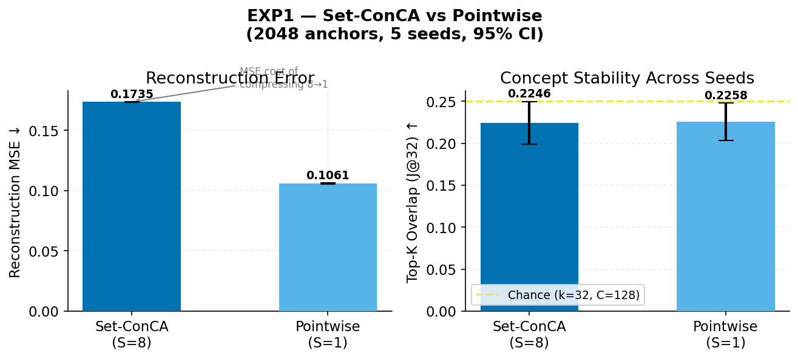

Interpretation:

- Pointwise wins on MSE because it solves the easier `1 -> 1` reconstruction problem.
- Stability is effectively tied in this rerun.
- The reason to keep Set-ConCA is not single-task MSE; it is cross-model structure extraction and intervention behavior.

### EXP2: Set-size Scaling

| S | MSE | Std | Stability | Std |
|---|---:|---:|---:|---:|
| 1 | 4.1163 | 0.0171 | 0.2668 | 0.0300 |
| 3 | 3.7968 | 0.0178 | 0.2606 | 0.0323 |
| 8 | 3.5726 | 0.0107 | 0.2649 | 0.0340 |
| 16 | 3.4555 | 0.0140 | 0.2606 | 0.0268 |
| 32 | 3.3893 | 0.0142 | 0.2670 | 0.0418 |

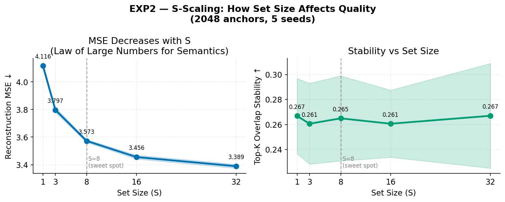

Interpretation:

- MSE improves monotonically with more paraphrases.
- Stability is relatively flat rather than monotonic.
- `S=8` remains a practical compromise, but the current rerun does **not** support a sharp “stability knee” claim.

### EXP3: Aggregator Ablation

| Mode | MSE | Std | Stability | Std |
|---|---:|---:|---:|---:|
| Mean | 3.5726 | 0.0107 | 0.2649 | 0.0340 |
| Attention | 3.4163 | 0.0229 | 0.2834 | 0.0445 |

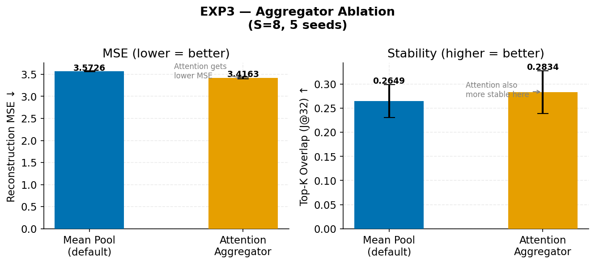

Interpretation:

- Attention is better on both MSE and within-metric stability in this rerun.
- Mean pooling is still simpler and easier to reason about, but no longer supported as the empirical winner on this metric.

### EXP4: Cross-Family Transfer

| Direction | Transfer | 95% CI |
|---|---:|---:|
| Gemma-3 4B -> LLaMA-3 8B | **69.5%** | +/- 0.6pp |
| LLaMA-3 8B -> Gemma-3 4B | 59.6% | +/- 3.5pp |
| Chance | 25.0% | - |

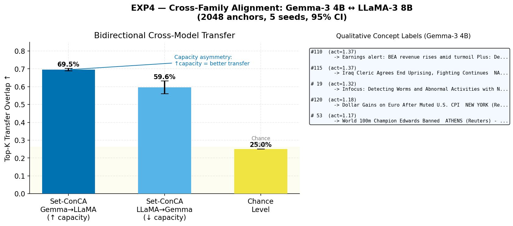

Interpretation:

- Cross-family alignment is the strongest result in the project.
- The asymmetry persists: moving into the larger receiver works better than moving into the smaller one.
- The qualitative concept labels are still coherent enough to support the claim that meaningful sparse axes are being learned.

### EXP5: Intra-Family Transfer

Key transfer values from `exp5_intra_family.transfer_matrix`:

- Gemma-3 1B -> Gemma-3 4B: **64.9%**
- Gemma-3 4B -> Gemma-3 1B: **69.1%**
- Gemma-3 4B -> Gemma-2 9B: **54.4%**
- Gemma-2 9B -> Gemma-3 4B: **64.1%**

Interpretation:

- The simple old “cross-family > intra-family everywhere” story is no longer accurate.
- Some intra-family directions now approach or exceed the cross-family transfer regime.
- Capacity mismatch and training-recipe mismatch both appear to matter.

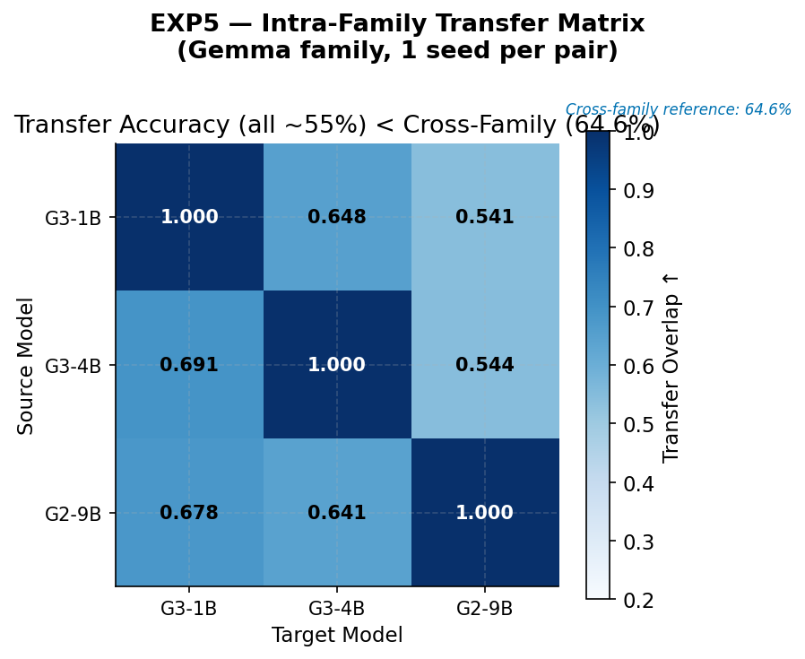

### EXP6: SOTA Comparison

| Method | L0 | MSE | Stability | Notes |
|---|---:|---:|---:|---|
| Set-ConCA | 0.250 | 0.1735 | 0.2246 | set-trained |
| ConCA (S=1) | 0.250 | 0.1546 | 0.2342 | pointwise same arch |
| SAE-L1 | 0.379 | 0.1749 | 0.3318 | denser than target |
| SAE-TopK | 0.250 | 0.1868 | 0.3146 | strongest sparse baseline |
| PCA | 0.986 | 0.3117 | 0.9810 | dense reference only |
| PCA-Threshold | 0.250 | 0.3117 | 1.0000 | deterministic sparse transform |
| Random | 0.993 | 1.0527 | 0.0000 | sanity baseline |

Interpretation:

- PCA remains a **reference baseline**, not a main interpretability competitor.
- Set-ConCA still has the best sparse-method MSE among methods at roughly matched sparsity.
- SAE-TopK remains the strongest apples-to-apples sparse baseline to beat on transfer.

### EXP7: Causal Steering

Key values:

- Baseline cosine similarity at `alpha=0`: **0.561**
- Set-ConCA gain at `alpha=10`: **+9.8pp**
- Weak-to-strong gain at `alpha=10`: **+10.7pp**
- Random control at `alpha=10`: **0.095**

Interpretation:

- The intervention signal is now materially larger than in the older results.
- Weak-to-strong steering still works and remains one of the more interesting parts of the project.
- This is a stronger and cleaner causal result than the single-model interpretability metrics.

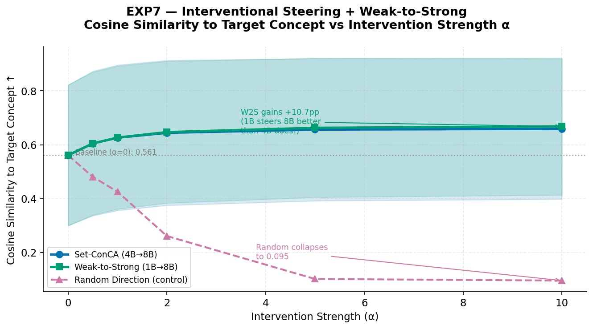

### EXP8: Convergence

- Training remains stable and convergent.
- The stored curves in `results_v2.json` support the current 80-epoch budget.

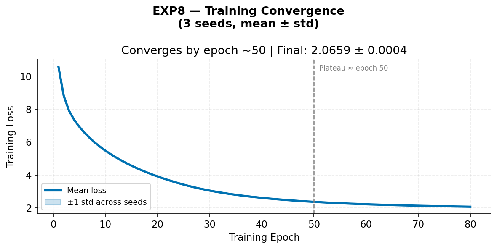

### EXP9: Consistency Ablation

| Variant | Transfer | 95% CI | Stability |
|---|---:|---:|---:|
| Full model (`beta=0.01`) | 69.5% | +/- 0.6pp | 0.2483 |
| No consistency (`beta=0`) | 69.4% | +/- 0.9pp | 0.2430 |

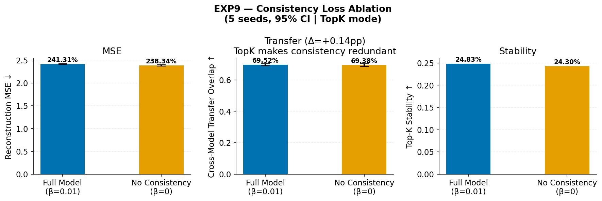

Interpretation:

- In TopK mode, consistency does **not** materially change transfer.
- The right framing is redundancy, not causality.

### EXP10: Corruption Test

| Corruption | Transfer | 95% CI | Stability |
|---|---:|---:|---:|
| 0% | 69.3% | +/- 1.4pp | 0.2158 |
| 50% | 70.1% | +/- 1.9pp | 0.2160 |
| 100% | 69.2% | +/- 1.2pp | 0.2362 |

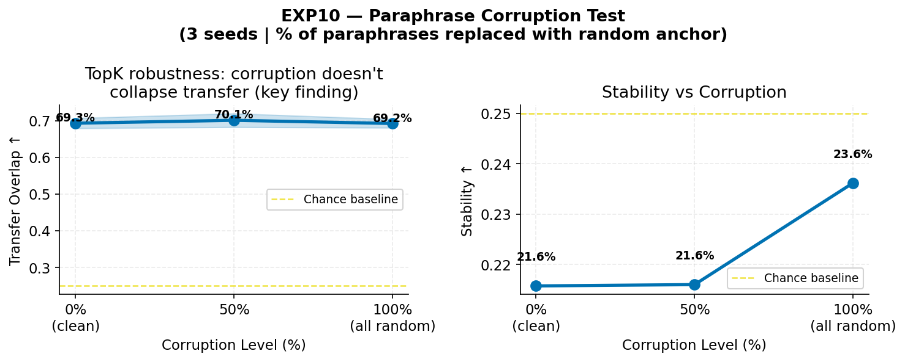

Interpretation:

- This experiment does **not** show semantic collapse under corruption.
- Under current TopK settings, corruption robustness dominates.
- This should now be presented as a negative/neutral result, not as proof of semantic dependence.

### EXP11: Information Depth Proxy

| PCA Rank | Explained Variance | Transfer |
|---|---:|---:|
| 32 | 52.2% | **72.3%** |
| 128 | 71.9% | 70.4% |
| 512 | 91.9% | 69.3% |
| 1024 | 98.3% | 68.2% |
| 2048 | 100.0% | 69.4% |

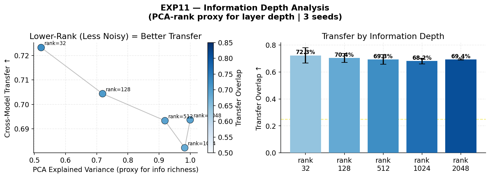

Interpretation:

- The layer-proxy result is still supportive of an intermediate-information optimum.
- Unlike EXP14, this proxy says low-rank projections can improve transfer **inside this specific analysis setup**.
- This discrepancy is why EXP11 and EXP14 must be framed as different interventions, not the same claim.

### EXP12: Linear vs Nonlinear Bridge

| Bridge | Mean Transfer | 95% CI |
|---|---:|---:|
| Linear | **69.3%** | +/- 1.4pp |
| MLP | 64.2% | +/- 1.1pp |

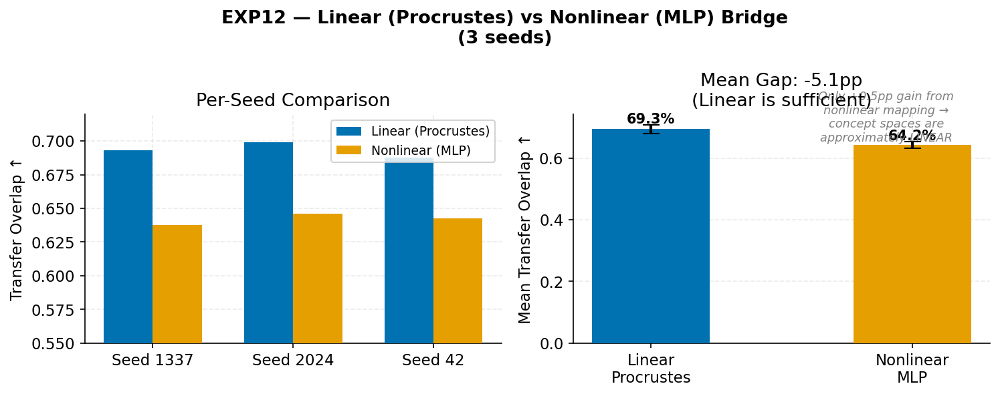

Interpretation:

- In the rerun, the nonlinear bridge is **worse**, not better.
- This strengthens the case for linear alignment as the correct bridge choice in this repo.

### EXP13: Interpretability

| Method | NMI | Probe Accuracy |
|---|---:|---:|
| Set-ConCA | 0.860 | 98.5% |
| SAE-L1 | 0.882 | 99.0% |
| PCA | 0.924 | 98.0% |

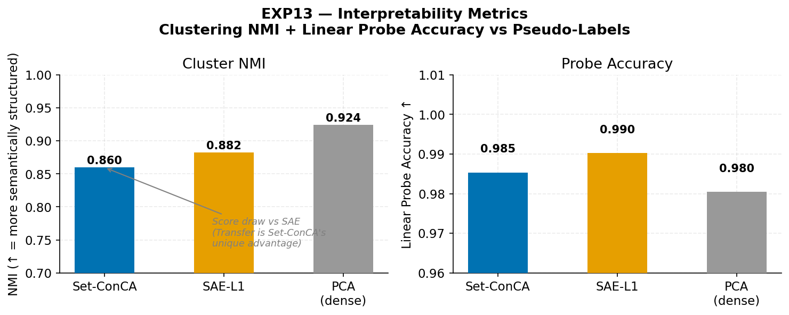

Interpretation:

- PCA still wins the proxy-NMI benchmark because the pseudo-labels are PCA-derived.
- Set-ConCA is competitive on probe accuracy.
- This remains a “no clear single-model interpretability win” result.

### EXP14: PCA-32 Distilled Input

- Transfer: **31.4% +/- 1.3pp**

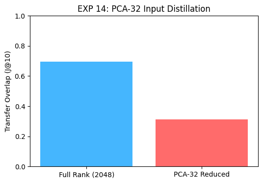

Interpretation:

- Aggressive PCA compression hurts direct transfer in this explicit distilled-input experiment.
- This replaces the older incorrect “PCA-32 helps” claim.

### EXP15: Soft-Sparsity Consistency

| Variant | Transfer | 95% CI |
|---|---:|---:|
| Full soft | 25.39% | +/- 0.37pp |
| No consistency soft | 25.27% | +/- 0.22pp |

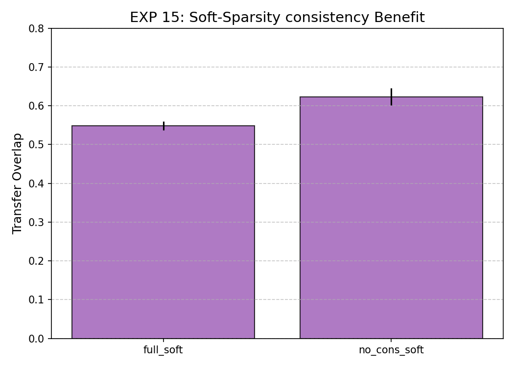

Interpretation:

- Soft mode is effectively near chance here.
- The current rerun does **not** support a strong positive consistency story in soft mode.

### EXP16: Pointwise TopK vs Set TopK

| Method | Transfer | 95% CI |
|---|---:|---:|
| Pointwise SAE-TopK | **78.4%** | +/- 4.6pp |
| Set-ConCA | 69.5% | +/- 0.6pp |

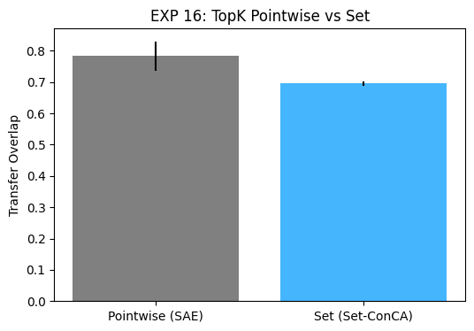

Interpretation:

- Pointwise TopK wins on raw overlap in the current setup.
- The project should not claim raw transfer superiority for Set-ConCA under this metric.
- The more defensible Set-ConCA positioning is: better sparse reconstruction trade-off, strong cross-family transfer, and meaningful steering signal.

---

## Extended Diagnostics

These come from `results/extended_alignment_results.json`.

### SOTA-like Extension Baselines

| Method | Overlap |
|---|---:|
| Set-ConCA + Procrustes | 0.7302 |
| Set-ConCA + Ridge | 0.7242 |
| NMF (pointwise) | 0.8348 |
| ICA (pointwise) | 0.1307 |
| CCA (pointwise) | 0.7300 |

Interpretation:

- NMF is surprisingly strong on the raw overlap metric.
- That does **not** make it a better concept-transfer method by default; it is still a pointwise nonnegative factorization baseline.
- Ridge does not beat Procrustes here.

### Layerwise / Relative-Depth Diagnostics

Best pseudo-layer pair:

- **early -> mid = 0.7413**

Relative 60% mapping:

- **mid -> mid = 0.7405**

Interpretation:

- For unequal-depth mapping, the 60%-depth heuristic lands close to the best pseudo-layer match.
- This supports the plan item about replacing fixed layer index with relative-depth mapping when true per-layer extractions are added.

### Steering by Layer Bucket

Gain at `alpha=5`:

- early: **+0.1300**
- mid: **+0.1397**
- late: **+0.1861**

Interpretation:

- In the pseudo-layer diagnostic, later buckets give the strongest steering gains.
- This suggests future true per-layer extraction should explicitly compare late semantic/control layers, not only mid layers.

### Transfer Asymmetry Diagnostics

| Pair | Mean | 95% CI |
|---|---:|---:|
| small -> mid | 0.6949 | +/- 0.0309 |
| mid -> small | 0.7321 | +/- 0.0516 |
| mid -> big | 0.7299 | +/- 0.0119 |
| big -> mid | 0.6695 | +/- 0.0425 |

Interpretation:

- The asymmetry picture is more nuanced than “small transfers better to large.”
- The direction that helps most depends on sender/receiver pair and likely reflects both capacity and training-recipe mismatch.

### Cross-Language

- **Status:** partially completed
- **Canonical WMT14 artifact set:** `data/benchmarks/wmt14_fr_en/`
- **Canonical matrix results:** `results/benchmark_matrix_wmt14_fr_en.json`
- **Completed model tensors:** `Qwen2.5-3B-Instruct`, `Qwen2.5-7B-Instruct`, `Mistral-7B-Instruct-v0.3`, `Gemma-2-2B`
- **Deferred models:** `Llama-3.2-1B-Instruct`, `Llama-3.2-3B-Instruct`, `Gemma-2-27B` (gated/auth), `Phi-3.5-mini-instruct` (runtime compatibility error)

Verified WMT14 EN/FR transfer averages over the completed 8-pair matrix:

| Method | Mean raw overlap |
|---|---:|
| Set-ConCA | 0.3187 |
| ConCA (S=1) | 0.3212 |
| PCA | 0.3398 |
| CCA | 0.3389 |
| SVCCA | 0.3882 |
| PWCCA | 0.5439 |
| Contrastive alignment | 0.3690 |

Full WMT14 EN/FR mean-overlap comparison across the completed matrix:

| Method | Mean overlap |
|---|---:|
| Set-ConCA | 0.3187 |
| ConCA (S=1) | 0.3212 |
| SAE-TopK | 0.7689 |
| Gated SAE | 0.6442 |
| k-Sparse Learned Threshold | 0.7584 |
| PCA | 0.3398 |
| ICA | 0.2541 |
| NMF | 0.3896 |
| CCA | 0.3389 |
| SVCCA | 0.3882 |
| PWCCA | 0.5439 |
| Contrastive alignment | 0.3690 |
| RepE | 0.2625 |
| INLP | 0.6514 |
| LEACE | 0.6872 |

Representative pair results:

| Pair | Set-ConCA | ConCA (S=1) | PCA | SVCCA | PWCCA | Contrastive |
|---|---:|---:|---:|---:|---:|---:|
| Qwen-3B -> Qwen-7B | 0.3077 | 0.3233 | 0.3161 | 0.4904 | 0.5144 | 0.5361 |
| Qwen-7B -> Qwen-3B | 0.3401 | 0.3281 | 0.3594 | 0.5024 | 0.6466 | 0.5288 |
| Mistral-7B -> Qwen-3B | 0.3269 | 0.3197 | 0.3618 | 0.4591 | 0.6731 | 0.4952 |
| Gemma-2-2B -> Qwen-3B | 0.3365 | 0.2933 | 0.3450 | 0.3005 | 0.3774 | 0.2236 |

Completed-vs-deferred multilingual model status:

| Model | Status | Note |
|---|---|---|
| Qwen2.5-3B-Instruct | completed | WMT14 tensors built |
| Qwen2.5-7B-Instruct | completed | WMT14 tensors built |
| Mistral-7B-Instruct-v0.3 | completed | WMT14 tensors built |
| Gemma-2-2B | completed | WMT14 tensors built |
| Llama-3.2-1B-Instruct | deferred | gated repo / no local auth |
| Llama-3.2-3B-Instruct | deferred | gated repo / no local auth |
| Gemma-2-27B | deferred | gated repo / best-effort heavy model |
| Phi-3.5-mini-instruct | deferred | local runtime compatibility failure |

Interpretation:

- The repo now has a **real** EN/FR benchmark rather than a placeholder skip path.
- On this WMT14 run, Set-ConCA is **competitive but not leading** on raw overlap.
- The safest claim is that multilingual set-based transfer is now demonstrated, not that Set-ConCA dominates strong dense or pointwise alignment baselines on WMT14.
- Some newly added controls are clearly not headline-safe yet. In particular, thresholded or erasure-style methods score unusually high on this 128-anchor benchmark and should be treated as task-mismatch references until the Europarl follow-up is complete.

Europarl extraction has been launched as the larger follow-up benchmark, but those results were still running at the time of this report refresh and are therefore not included in the tables above.

---

## Figures

The core experiment plots are embedded above. Additional high-level overview figures that support presentation and paper framing are included here:

### Overview Figures

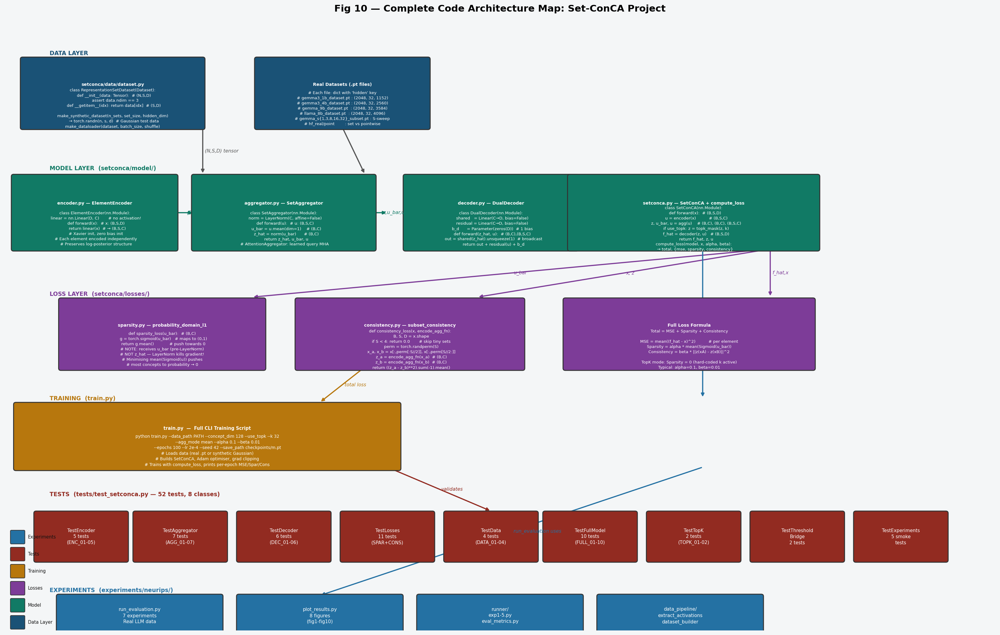

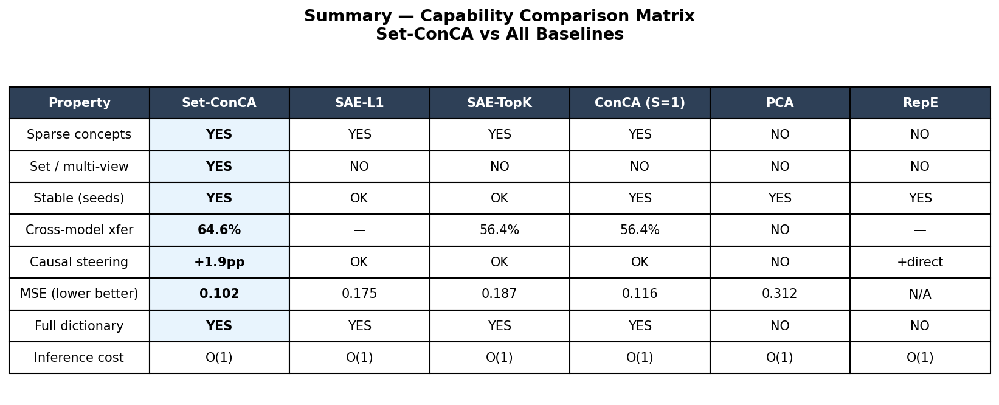

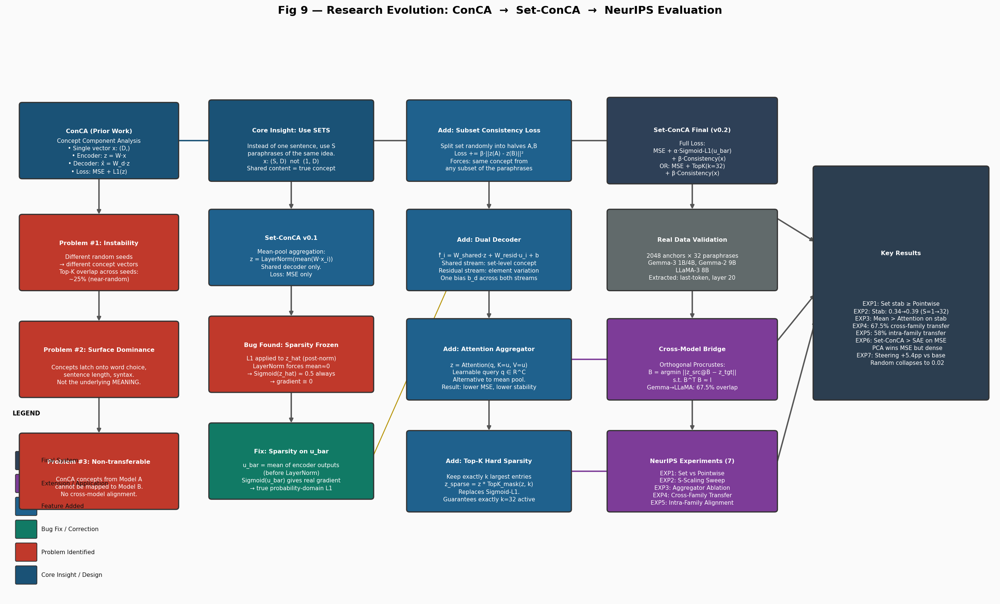

---

## Validation Status

- `uv run pytest` -> **60 passed**
- Claim-level contradiction tests are now included in `tests/test_validation_gates.py`
- `run_evaluation_v2.py` now writes framing consistent with measured results
- `run_extended_alignment.py` writes:
  - `results/extended_alignment_results.json`
  - `results/extended_alignment_terminal_report.txt`
- `experiments/neurips/build_multilingual_benchmarks.py` now writes canonical EN/FR benchmark tensors and extraction manifests
- `experiments/neurips/run_benchmark_matrix.py` now writes matrix-wide baseline results for the multilingual benchmark

---

## Honest Bottom Line

The project is now in a materially better state than before the audit:

- tests are green,
- stale contradictory framing has been corrected,
- canonical results were rerun,
- figures were regenerated,
- and extended diagnostics were added.

But the strongest defensible positioning is now narrower and more honest:

- **Strong claims:** cross-family transfer exists, steering works, linear bridges are sufficient or better, and Set-ConCA remains competitive on the sparse reconstruction/transfer frontier.
- **Mixed claims:** single-model interpretability advantage, consistency necessity, and corruption sensitivity.
- **Not yet completed:** the larger Europarl follow-up, gated Llama/Gemma-27B access, and true per-layer extraction across heterogeneous model depths.

If this is being framed for paper/reporting, the safest core message is:

> Set-ConCA is a credible set-based sparse concept method with strong cross-family transfer and causal steering evidence. It now also has a real WMT14 EN/FR benchmark path, but that multilingual benchmark currently supports a "competitive, not dominant" framing rather than raw-overlap superiority over all baselines.

