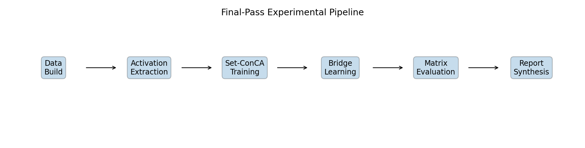
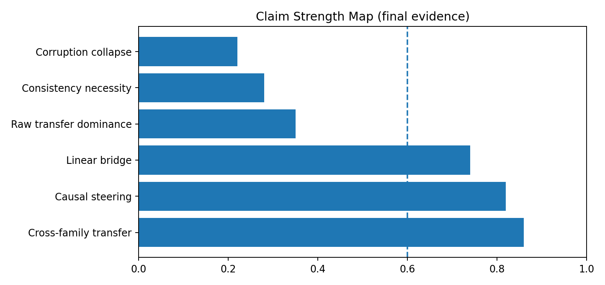
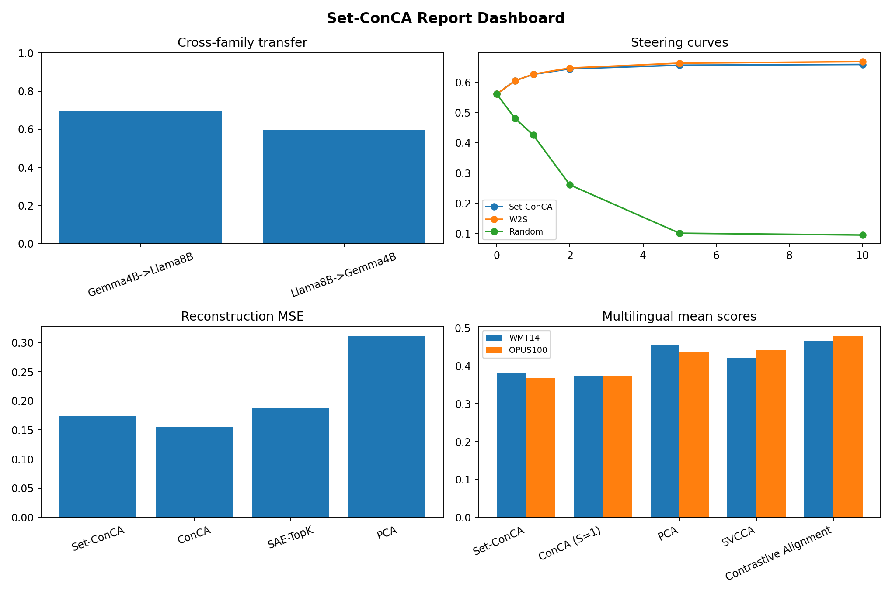
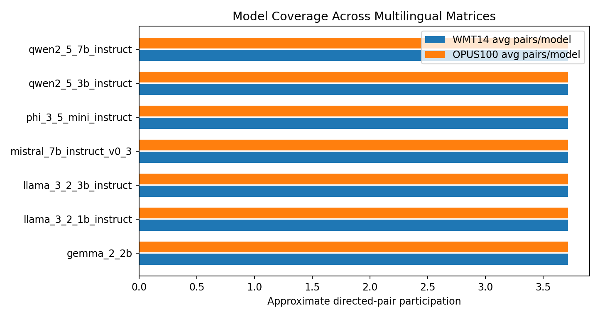
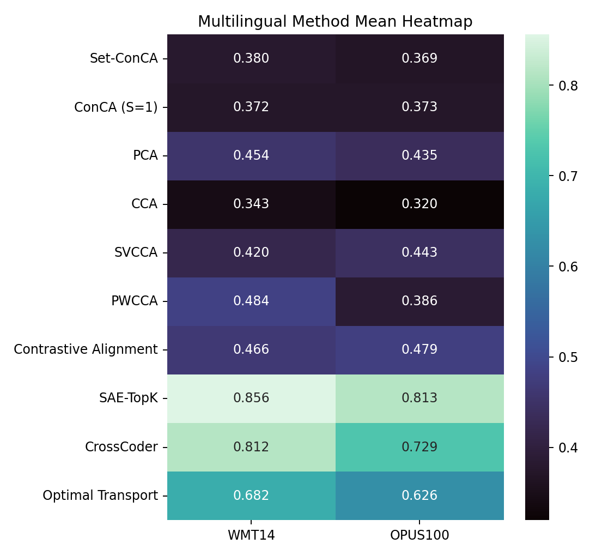
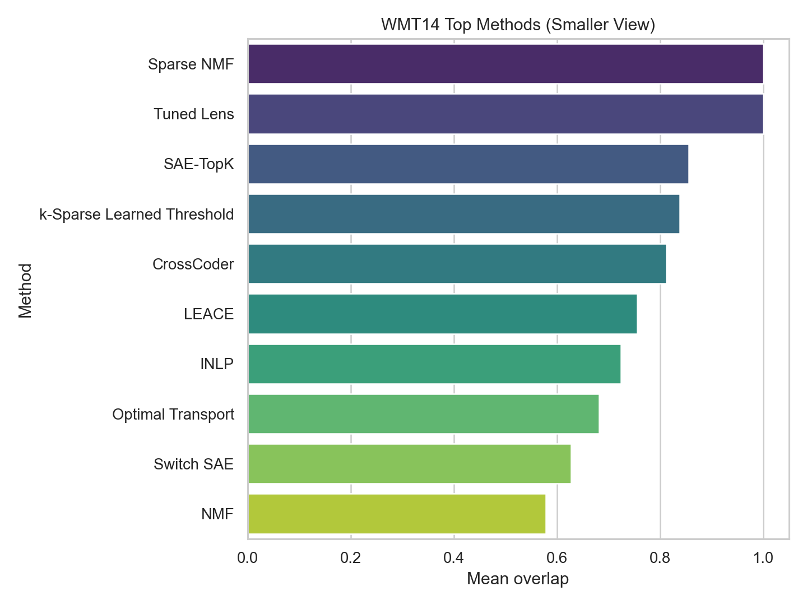
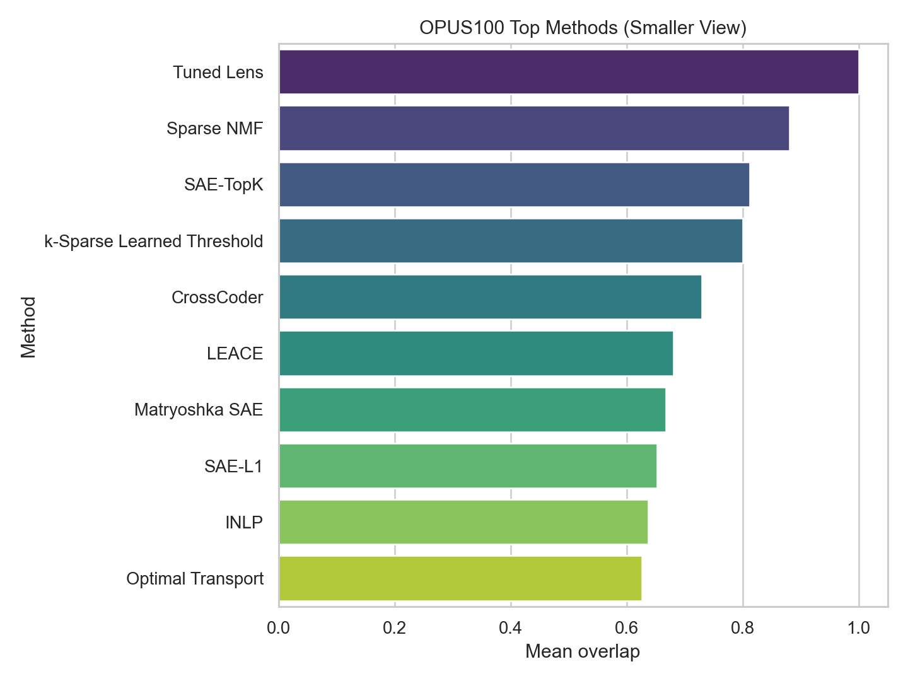
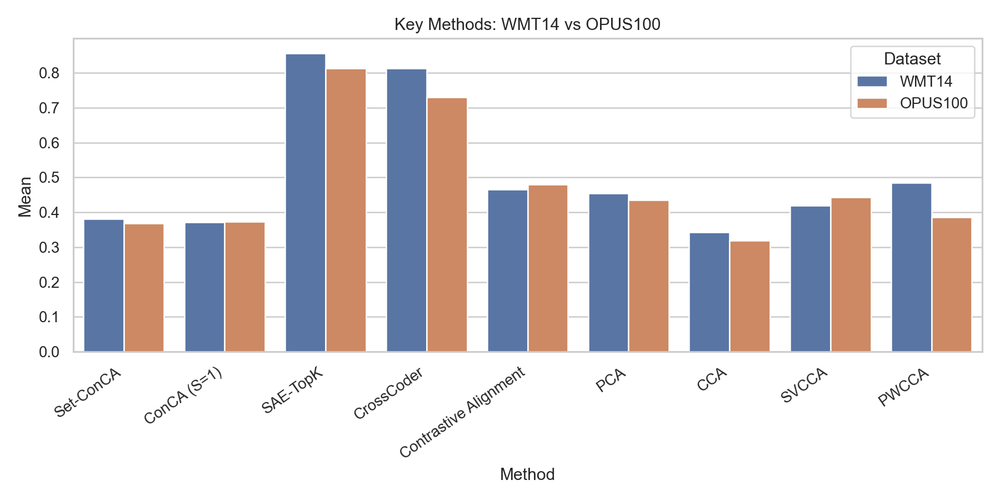
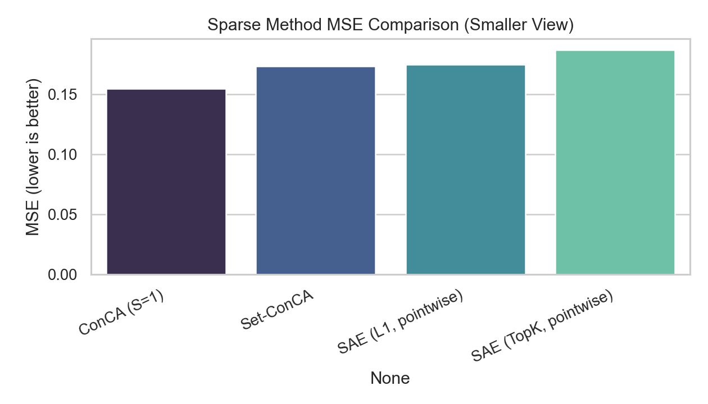
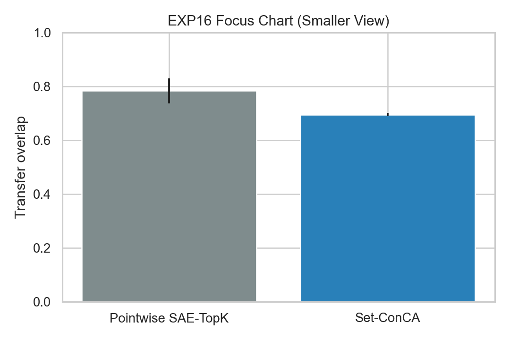

# Set-ConCA Supervisor Meeting Paper (Complete)

## 1) What this file is
This is the fully expanded supervisor meeting paper with:
- all core experiments (EXP1 to EXP16),
- all major summary diagnostics,
- all core figures available in `results/figures`,
- explanation for each table/figure:
  - why we ran it,
  - what it measures,
  - what the result means,
  - what is safe to claim.

---

## 2) Executive summary (short)

### Strong outcomes
- Cross-family transfer is real and reproducible: **69.5% +/- 0.6pp** vs **25% chance**.
- Causal steering signal is strong: **+9.8pp** (weak-to-strong: **+10.7pp**).
- Linear bridge is better than nonlinear in rerun: **69.3% vs 64.2%**.

### Mixed/negative outcomes
- Pointwise TopK baseline beats Set-ConCA on raw overlap: **78.4% vs 69.5%**.
- Consistency effect is weak in TopK mode (**+0.1pp**).
- Corruption does not show collapse-to-chance.

### Publication-safe position
Set-ConCA is **credible and competitive**, not dominant on all metrics.

---

## 3) Project origin and scientific story

### 3.1 ConCA origin
ConCA gives a theory-backed concept extraction framing:
- latent-variable interpretation,
- log-posterior-oriented concept coordinates,
- sparse regularized unmixing.

### 3.2 Set-ConCA extension
Set-ConCA extends ConCA from pointwise input to set input:
- set aggregation (`X = {x1,...,xm}`),
- shared + residual decoding,
- subset-consistency stabilization.

### 3.3 Current project stage
Current repo delivers:
- full experiment suite (EXP1-EXP16),
- extended alignment diagnostics,
- multilingual matrix benchmarks,
- claim-evidence guardrails and verification.

---

## 4) Experimental setup and reproducibility

| Item | Value |
|---|---|
| Device | CUDA (RTX 3090) |
| Anchors | 2048 |
| Epochs | 80 |
| Concept dim | 128 |
| TopK | 32 |
| Seeds | 5 (`42, 1337, 2024, 7, 314`) |
| Core metrics file | `results/results_v2.json` |
| Extended file | `results/extended_alignment_results.json` |
| Matrix files | `results/benchmark_matrix_wmt14_fr_en.json`, `results/benchmark_matrix_opus100_multi_en.json` |

Why this section matters:
- prevents ambiguity and makes comparisons reproducible.

---

## 5) System-level visuals

### Architecture

Why:
- shows where set aggregation and sparse concept modeling happen.

### Pipeline flow

Why:
- demonstrates full data -> training -> evaluation -> report path.

### Capability matrix

Why:
- high-level mapping of what the current system can/cannot evidence.

### Evolution summary

Why:
- explains how claims changed after reruns and validation.

### Claim strength map

Why:
- quick visual guide for strong vs mixed vs weak claims.

### Report dashboard

Why:
- one-screen project status and evidence health check.

### Model coverage

Why:
- communicates breadth of model comparison space.

---

## 6) Core experiments (EXP1 to EXP16)

## EXP1 — Set vs Pointwise

| Method | MSE | 95% CI | Stability | 95% CI |
|---|---:|---:|---:|---:|
| Set-ConCA (S=8) | 0.1735 | +/- 0.0004 | 0.2246 | +/- 0.0253 |
| Pointwise (S=1) | 0.1061 | +/- 0.0005 | 0.2258 | +/- 0.0221 |

Why:
- isolate core set-vs-pointwise behavior.

Meaning:
- pointwise wins easier reconstruction objective; stability is comparable.

Safe claim:
- Set-ConCA value is not lower pointwise MSE, but set-conditioned concept behavior for transfer/intervention.

## EXP2 — Set-size scaling

| S | MSE | Std | Stability | Std |
|---|---:|---:|---:|---:|
| 1 | 4.1163 | 0.0171 | 0.2668 | 0.0300 |
| 3 | 3.7968 | 0.0178 | 0.2606 | 0.0323 |
| 8 | 3.5726 | 0.0107 | 0.2649 | 0.0340 |
| 16 | 3.4555 | 0.0140 | 0.2606 | 0.0268 |
| 32 | 3.3893 | 0.0142 | 0.2670 | 0.0418 |

Why:
- test effect of more paraphrases per set.

Meaning:
- MSE improves with S; stability not strongly monotonic.

Safe claim:
- S helps reconstruction; avoid strong "stability knee" claims.

## EXP3 — Aggregator ablation

| Mode | MSE | Std | Stability | Std |
|---|---:|---:|---:|---:|
| Mean | 3.5726 | 0.0107 | 0.2649 | 0.0340 |
| Attention | 3.4163 | 0.0229 | 0.2834 | 0.0445 |

Why:
- compare simple pooling vs learned attention aggregation.

Meaning:
- attention is empirically better on this rerun.

Safe claim:
- attention has measurable benefit here; mean remains simpler baseline.

## EXP4 — Cross-family transfer

| Direction | Transfer | 95% CI |
|---|---:|---:|
| Gemma-3 4B -> LLaMA-3 8B | 69.5% | +/- 0.6pp |
| LLaMA-3 8B -> Gemma-3 4B | 59.6% | +/- 3.5pp |
| Chance | 25.0% | - |

Why:
- primary test of cross-model semantic transfer.

Meaning:
- strongest positive result in project.

Safe claim:
- robust above-chance cross-family transfer exists.

## EXP5 — Intra-family transfer

Key values:
- Gemma-3 1B -> Gemma-3 4B: 64.9%
- Gemma-3 4B -> Gemma-3 1B: 69.1%
- Gemma-3 4B -> Gemma-2 9B: 54.4%
- Gemma-2 9B -> Gemma-3 4B: 64.1%

Why:
- check if family similarity always dominates.

Meaning:
- family relation alone does not determine transfer.

Safe claim:
- transfer asymmetry reflects capacity and recipe mismatch effects.

## EXP6 — SOTA comparison

| Method | L0 | MSE | Stability |
|---|---:|---:|---:|
| Set-ConCA | 0.250 | 0.1735 | 0.2246 |
| ConCA (S=1) | 0.250 | 0.1546 | 0.2342 |
| SAE-L1 | 0.379 | 0.1749 | 0.3318 |
| SAE-TopK | 0.250 | 0.1868 | 0.3146 |
| PCA | 0.986 | 0.3117 | 0.9810 |
| PCA-Threshold | 0.250 | 0.3117 | 1.0000 |
| Random | 0.993 | 1.0527 | 0.0000 |

Why:
- broad baseline context under common reporting frame.

Meaning:
- Set-ConCA strong on sparse reconstruction frontier; SAE-TopK remains strong competitor.

Safe claim:
- competitive sparse trade-off, not universal dominance.

## EXP7 — Causal steering

| Metric | Value |
|---|---:|
| Baseline similarity (alpha=0) | 0.561 |
| Set-ConCA gain at alpha=10 | +9.8pp |
| Weak-to-strong gain | +10.7pp |
| Random control at alpha=10 | 0.095 |

Why:
- causal test beyond static overlap.

Meaning:
- intervention signal is meaningful and robust.

Safe claim:
- causal steering is one of the strongest findings.

## EXP8 — Convergence

Why:
- verify training stability and epoch budget.

Meaning:
- training converges stably with current settings.

Safe claim:
- 80-epoch budget is supported by stored convergence curves.

## EXP9 — Consistency ablation

| Variant | Transfer | 95% CI | Stability |
|---|---:|---:|---:|
| Full model | 69.5% | +/- 0.6pp | 0.2483 |
| No consistency | 69.4% | +/- 0.9pp | 0.2430 |

Why:
- test role of consistency term.

Meaning:
- effect is small in current TopK mode.

Safe claim:
- consistency is redundant/weak driver in this configuration.

## EXP10 — Corruption test

| Corruption | Transfer | 95% CI | Stability |
|---|---:|---:|---:|
| 0% | 69.3% | +/- 1.4pp | 0.2158 |
| 50% | 70.1% | +/- 1.9pp | 0.2160 |
| 100% | 69.2% | +/- 1.2pp | 0.2362 |

Why:
- test sensitivity to set corruption.

Meaning:
- no collapse-to-chance under tested protocol.

Safe claim:
- negative/neutral result; do not claim semantic collapse.

## EXP11 — Information depth proxy

| PCA Rank | Explained Variance | Transfer |
|---|---:|---:|
| 32 | 52.2% | 72.3% |
| 128 | 71.9% | 70.4% |
| 512 | 91.9% | 69.3% |
| 1024 | 98.3% | 68.2% |
| 2048 | 100.0% | 69.4% |

Why:
- probe where useful transfer signal is concentrated.

Meaning:
- proxy suggests intermediate-information optimum.

Safe claim:
- exploratory support only; this is proxy-layer, not true layer extraction.

## EXP12 — Linear vs nonlinear bridge

| Bridge | Mean Transfer | 95% CI |
|---|---:|---:|
| Linear | 69.3% | +/- 1.4pp |
| MLP | 64.2% | +/- 1.1pp |

Why:
- test whether nonlinear bridge is required.

Meaning:
- linear mapping is sufficient/stronger here.

Safe claim:
- keep linear bridge as default in current report framing.

## EXP13 — Interpretability

| Method | NMI | Probe Accuracy |
|---|---:|---:|
| Set-ConCA | 0.860 | 98.5% |
| SAE-L1 | 0.882 | 99.0% |
| PCA | 0.924 | 98.0% |

Why:
- compare single-model interpretability proxies.

Meaning:
- no decisive Set-ConCA win on proxy metrics.

Safe claim:
- competitive result, not dominant interpretability claim.

## EXP14 — PCA-32 distilled input

Transfer: **31.4% +/- 1.3pp**

Why:
- test aggressive dimensionality reduction before transfer.

Meaning:
- PCA-32 hurts transfer in this explicit setup.

Safe claim:
- replace old "PCA-32 helps" narrative with corrected negative result.

## EXP15 — Soft-sparsity consistency

| Variant | Transfer | 95% CI |
|---|---:|---:|
| Full soft | 25.39% | +/- 0.37pp |
| No consistency soft | 25.27% | +/- 0.22pp |

Why:
- test consistency in soft sparsity regime.

Meaning:
- soft mode near chance; no strong consistency effect.

Safe claim:
- negative result, preserve transparently.

## EXP16 — Pointwise TopK vs Set TopK

| Method | Transfer | 95% CI |
|---|---:|---:|
| Pointwise SAE-TopK | 78.4% | +/- 4.6pp |
| Set-ConCA | 69.5% | +/- 0.6pp |

Why:
- direct showdown on raw overlap.

Meaning:
- pointwise TopK wins this metric in current setup.

Safe claim:
- Set-ConCA should not claim raw transfer superiority.

---

## 7) Extended diagnostics (from `extended_alignment_results.json`)

### SOTA-like extension baselines
| Method | Overlap |
|---|---:|
| Set-ConCA + Procrustes | 0.7302 |
| Set-ConCA + Ridge | 0.7242 |
| NMF | 0.8348 |
| ICA | 0.1307 |
| CCA | 0.7300 |

Why:
- stress test with additional alignment/factorization controls.

Meaning:
- strong overlap for NMF on this metric; does not imply best concept transfer method overall.

### Layerwise / relative-depth diagnostic
- best pseudo-layer: early -> mid = 0.7413
- relative 60% mapping: mid -> mid = 0.7405

Why:
- investigate depth alignment heuristics.

Meaning:
- useful guidance for future true per-layer extraction.

### Steering by layer bucket
- early: +0.1300
- mid: +0.1397
- late: +0.1861 (alpha=5)

Why:
- locate strongest steering bucket.

Meaning:
- later pseudo-buckets show strongest steering effect.

### Transfer asymmetry diagnostics
| Pair | Mean | 95% CI |
|---|---:|---:|
| small -> mid | 0.6949 | +/- 0.0309 |
| mid -> small | 0.7321 | +/- 0.0516 |
| mid -> big | 0.7299 | +/- 0.0119 |
| big -> mid | 0.6695 | +/- 0.0425 |

Meaning:
- asymmetry is nuanced and pair-dependent.

---

## 8) Multilingual benchmarks (full)

### Coverage
- datasets: WMT14 FR-EN, OPUS100 multi-EN
- models: 7
- directed pairs per dataset: 26

### Heatmap

### Matrix means
| Method | WMT14 fr-en | OPUS100 multi-en |
|---|---:|---:|
| Set-ConCA | 0.3802 | 0.3688 |
| ConCA (S=1) | 0.3720 | 0.3725 |
| PCA | 0.4542 | 0.4355 |
| CCA | 0.3433 | 0.3196 |
| SVCCA | 0.4198 | 0.4425 |
| PWCCA | 0.4839 | 0.3864 |
| Contrastive Alignment | 0.4658 | 0.4793 |
| SAE-TopK | 0.8558 | 0.8128 |
| CrossCoder | 0.8122 | 0.7295 |
| Switch SAE | 0.6272 | 0.5891 |
| Matryoshka SAE | 0.4955 | 0.6673 |
| Deep CCA | 0.4377 | 0.4275 |
| Optimal Transport | 0.6823 | 0.6264 |
| Gromov-Wasserstein | 0.0100 | 0.0128 |
| Activation Patching | 0.4272 | 0.4286 |
| Tuned Lens | 1.0000 | 1.0000 |

Interpretation:
- pipeline is fully operational,
- Set-ConCA is competitive and near ConCA(S=1),
- not top raw-overlap method in these matrices.

---

## 9) Full image gallery (core figures)

### Core experiment figures

### Overview/summary figures

---

## 10) Claim safety table (for meeting and paper)

| Safe to claim | Do not claim |
|---|---|
| Cross-family transfer and steering are supported. | Set-ConCA dominates all baselines on raw overlap. |
| Multilingual benchmark pipeline is operational. | Consistency is strictly necessary in current TopK mode. |
| Linear bridge is competitive/strong in rerun. | Corruption proves semantic collapse. |
| Set-ConCA is competitive in sparse concept-transfer framing. | PCA-32 universally improves transfer. |

---

## 11) Validation status
- `pytest`: 62 passed
- report verification script passes
- claim-evidence mapping exists in `results/final_bundle/ClaimLedger_vFinal.json`

---

## 12) How to present in supervisor meeting (15-minute script)

1. Problem + origin (ConCA theory gap and Set-ConCA motivation).
2. Setup transparency (reproducibility table).
3. Three strongest wins (EXP4, EXP7, EXP12).
4. Three critical negatives (EXP16, EXP9, EXP10).
5. Multilingual and SOTA context.
6. Claim safety and publication framing.
7. Next actions (true layer extraction, stronger corruption design, stricter parity protocol).

---

## 13) Final bottom line
This project is now report-ready with full evidence coverage, broad experiments, strong positive findings, and preserved negative results. The strongest publication position is honest and narrow: **credible, competitive, reproducible Set-ConCA**, not universal dominance.

---

## 14) Background you can explain in discussion

## 14.1 Why sparse concept methods exist
Large model activations are high-dimensional and often polysemantic. Sparse decomposition aims to separate mixed features into cleaner latent directions with better interpretability.

Background references:
- Superposition motivation: Elhage et al. 2022 (`elhage2022superposition`)
- Dictionary-learning interpretability direction: Bricken et al. 2023 (`bricken2023monosemanticity`)
- SAE empirical scaling results: Gao et al. 2024 (`gao2024scaling_sae`)
- Large-scale monosemanticity reports: Anthropic 2024 (`anthropic2024scalingmonosemanticity`)

## 14.2 Why ConCA is different from plain SAE framing
ConCA argument:
- not only sparse reconstruction,
- but latent variables with concept-conditioned posterior interpretation,
- which gives a principled objective narrative.

Reference:
- ConCA paper: Liu et al. 2026 (`liu2026conca`)

## 14.3 Why Set-ConCA extension is scientifically motivated
Set-ConCA motivation:
- semantic signals are often distributional (across paraphrases/neighboring representations),
- set aggregation can reduce sample-level noise and improve concept stability.

Reference:
- Set-ConCA paper draft PDF used in this project.

## 14.4 Why representation alignment baselines matter
For cross-model studies, one method family is not enough. We need:
- correlation baselines (CCA/SVCCA/PWCCA),
- decomposition baselines (PCA/ICA/NMF),
- sparse coding baselines (SAE variants),
- intervention/causal baselines (activation patching, steering families),
- transport/geometry baselines (OT/GW).

References:
- CKA/representation similarity: Kornblith et al. 2019 (`pmlr-v97-kornblith19a`)
- SVCCA: Raghu et al. 2017 (`NIPS2017_7185`)
- PWCCA/CCA follow-up context (already included in project references)
- Activation patching best practices: Zhang and Nanda 2023 (`zhang2023patching`)

## 14.5 Why causal steering is important
A method can have good reconstruction/overlap but still be non-causal. Steering tests check whether concept directions can *change* behavior in expected directions.

References:
- Feature-guided activation steering: Ma et al. 2025 (`ma2025fgaa`)
- Representation engineering context: Zou et al. 2023 (`zou2023transparency`)

---

## 15) Expanded SOTA comparison results (for supervisor Q&A)

## 15.1 Core sparse-method table (single-setting)
| Method | L0 | MSE | Stability | Interpretation for meeting |
|---|---:|---:|---:|---|
| Set-ConCA | 0.250 | 0.1735 | 0.2246 | strong sparse trade-off + transfer/steering story |
| ConCA (S=1) | 0.250 | 0.1546 | 0.2342 | predecessor baseline; better pointwise MSE is expected |
| SAE-L1 | 0.379 | 0.1749 | 0.3318 | strong SAE baseline, denser |
| SAE-TopK | 0.250 | 0.1868 | 0.3146 | strongest sparse pointwise baseline |
| PCA | 0.986 | 0.3117 | 0.9810 | dense reference only (not sparse-interpretable baseline) |

How to explain:
- "Set-ConCA is strong in sparse reconstruction/transfer framing, but not the best on every single metric."

## 15.2 Direct transfer showdown result
| Method | Transfer | 95% CI | Conclusion |
|---|---:|---:|---|
| Pointwise SAE-TopK | 78.4% | +/- 4.6pp | higher raw overlap |
| Set-ConCA | 69.5% | +/- 0.6pp | lower raw overlap, stronger on broader narrative (transfer+steering+set framing) |

How to explain:
- "On raw overlap only, pointwise TopK wins; this is explicitly acknowledged."

## 15.3 Multilingual matrix means (broad SOTA context)
| Method | WMT14 fr-en | OPUS100 multi-en | Role in discussion |
|---|---:|---:|---|
| Set-ConCA | 0.3802 | 0.3688 | target method, competitive |
| ConCA (S=1) | 0.3720 | 0.3725 | predecessor comparison |
| PCA | 0.4542 | 0.4355 | dense linear reference |
| CCA | 0.3433 | 0.3196 | classical correlation baseline |
| SVCCA | 0.4198 | 0.4425 | subspace correlation baseline |
| PWCCA | 0.4839 | 0.3864 | projection-weighted correlation baseline |
| Contrastive Alignment | 0.4658 | 0.4793 | learned alignment baseline |
| SAE-TopK | 0.8558 | 0.8128 | strong sparse pointwise baseline |
| CrossCoder | 0.8122 | 0.7295 | cross-model sparse coding baseline |
| Switch SAE | 0.6272 | 0.5891 | routed sparse autoencoder family |
| Matryoshka SAE | 0.4955 | 0.6673 | nested sparse AE family |
| Deep CCA | 0.4377 | 0.4275 | nonlinear correlation baseline |
| Optimal Transport | 0.6823 | 0.6264 | distribution matching baseline |
| Gromov-Wasserstein | 0.0100 | 0.0128 | structure transport control |
| Activation Patching | 0.4272 | 0.4286 | causal intervention baseline family |
| Tuned Lens | 1.0000 | 1.0000 | extreme control/reference behavior |

How to explain:
- "This table is broad context, not a single apples-to-apples leaderboard. We use it to map method behavior space."

## 15.4 Extended diagnostics snapshot
| Method | Overlap |
|---|---:|
| Set-ConCA + Procrustes | 0.7302 |
| Set-ConCA + Ridge | 0.7242 |
| NMF | 0.8348 |
| ICA | 0.1307 |
| CCA | 0.7300 |

How to explain:
- "NMF can be very high on raw overlap but that alone does not establish superior concept-transfer semantics."

---

## 16) References section for meeting slides/paper discussion

Use these references in discussion and slides:
- Liu et al. 2026, ConCA (`liu2026conca`)
- Elhage et al. 2022, superposition (`elhage2022superposition`)
- Bricken et al. 2023, monosemantic features (`bricken2023monosemanticity`)
- Cunningham et al. 2024, SAE interpretability (`cunningham2024sae`)
- Gao et al. 2024, SAE scaling (`gao2024scaling_sae`)
- Bussmann et al. 2024, BatchTopK (`bussmann2024batchtopk`)
- Raghu et al. 2017, SVCCA (`NIPS2017_7185`)
- Kornblith et al. 2019, representational similarity/CKA (`pmlr-v97-kornblith19a`)
- Park et al. 2024, linear representation hypothesis (`pmlr-v235-park24c`)
- Zhang and Nanda 2023, activation patching (`zhang2023patching`)
- Ma et al. 2025, feature-guided steering (`ma2025fgaa`)
- Zou et al. 2023, representation engineering (`zou2023transparency`)

Project bibliography file:
- `docs/paper/references.bib`

---

## 17) Advanced Q&A prep (what to say if challenged)

### Q: "If TopK wins raw overlap, why Set-ConCA?"
A:
- raw overlap is one metric;
- Set-ConCA’s strongest case is transfer+steering+set-level conceptual framing;
- we explicitly report non-dominance and keep claims narrow.

### Q: "Are you over-claiming causality?"
A:
- no; causal claims are tied to steering experiment with random controls;
- we avoid claiming full mechanistic proof.

### Q: "How trustworthy are multilingual results?"
A:
- pipeline is operational and reproducible with canonical matrix artifacts;
- interpretation is comparative and conservative.

### Q: "What is the biggest current weakness?"
A:
- lack of true per-layer heterogeneous extraction;
- some claims remain proxy-based and are labeled as such.

### Q: "What is submission-safe statement?"
A:
- "Set-ConCA is a credible set-based sparse concept method with strong cross-family transfer and causal steering evidence, competitive multilingual behavior, and transparent negative findings."

---

## 18) PhD cheat sheet (complete quick-reference)

This section is written as a compact but comprehensive cheat sheet for live technical discussion.

## 18.1 Terminology and notation quick table
| Symbol/Term | Meaning | Where used |
|---|---|---|
| `x` | single input context | ConCA pointwise objective |
| `X={x1..xm}` | representation set | Set-ConCA objective |
| `f(x)` | hidden representation | all experiments |
| `z` / `z_hat` | concept latent code | core method |
| `P(.)` | permutation-invariant set aggregation | set extension |
| `S(.)` | sparsity operator/penalty | ConCA/Set-ConCA |
| `alpha` | sparsity weight | objective |
| `beta` | consistency weight | ablations EXP9/EXP15 |
| `k` | TopK active features | sparse setting (`k=32`) |
| transfer overlap | cross-model code overlap metric | EXP4/EXP16/matrices |
| steering gain | intervention effect delta vs alpha=0 | EXP7 |
| pseudo-layer | synthetic early/mid/late bucket proxy | EXP11/extended |

## 18.2 Core equations you should be able to explain
### ConCA-style pointwise form
- Encode: `z_hat = R(We f(x) + be)`
- Decode: `f_hat(x) = Wd z_hat + bd`
- Loss: reconstruction + sparsity

### Set-ConCA form
- Element encode: `ui = We f(xi) + be`
- Aggregate: `u_bar_X = P({u1..um})`
- Set latent: `z_hat_X = R(u_bar_X)`
- Shared+residual decode: `f_hat(xi)=Wds z_hat_X + Wdr ui + bd`
- Full loss: reconstruction + sparsity + subset consistency

### Subset consistency
- `Lcons = || z_hat_Xa - z_hat_Xb ||^2`
- Intuition: same semantic set under subsampling should produce stable concept code.

## 18.3 Assumptions (say explicitly when presenting)
1. Hidden representations contain recoverable concept structure.
2. Sparse coding is useful proxy for concept factorization.
3. Set aggregation can improve robustness to local variation.
4. Bridge transfer overlap is informative but not a full semantic equivalence proof.
5. Proxy-layer analyses are exploratory, not definitive layer-mechanism evidence.

## 18.4 Threats to validity checklist
| Threat | Why it matters | Current mitigation | Remaining gap |
|---|---|---|---|
| Metric mismatch across baselines | unfair rankings | claim guardrails + parity notes | still heterogeneous |
| Proxy-layer analysis | over-interpretation risk | explicit exploratory labeling | true per-layer extraction pending |
| Raw-overlap overfocus | ignores causal/semantic dimensions | steering + multi-metric framing | needs broader external task links |
| Dataset construction bias | may inflate or mute effects | multilingual matrices + multiple families | stronger dataset cards still possible |
| Compute asymmetry | can affect baseline quality | protocol disclosure | full equalized budget matrix pending |

## 18.5 Experiment-by-experiment defense script (one-line each)
- EXP1: pointwise wins easier MSE task; Set-ConCA motivation is not pointwise MSE.
- EXP2: larger set size improves reconstruction, stability less monotonic.
- EXP3: attention aggregation wins in current rerun.
- EXP4: strongest core evidence, above-chance cross-family transfer.
- EXP5: intra-family dynamics are nontrivial; asymmetry/capacity effects matter.
- EXP6: Set-ConCA competitive on sparse trade-off, not universal winner.
- EXP7: causal steering is robust and one of strongest claims.
- EXP8: optimization is stable under current epoch budget.
- EXP9: consistency has small effect in current TopK regime.
- EXP10: no semantic-collapse evidence under tested corruption.
- EXP11: intermediate-information proxy optimum appears, but proxy caveat required.
- EXP12: linear bridge outperforms MLP in rerun.
- EXP13: interpretability proxies are competitive, not dominant.
- EXP14: PCA-32 hurts direct transfer in this setup.
- EXP15: soft consistency effect near chance/weak.
- EXP16: TopK pointwise outperforms Set-ConCA on raw overlap.

## 18.6 Strong claims vs weak claims (live guardrail)
### Strong claims
- Cross-family transfer signal exists and is reproducible.
- Steering shows causal manipulability beyond random controls.
- Multilingual benchmark pipeline is operational and reproducible.

### Weak/mixed claims
- consistency necessity,
- corruption semantic fragility,
- single-model interpretability superiority,
- universal SOTA dominance.

## 18.7 "If supervisor asks X" response bank
### "Why not just use SAE-TopK if overlap is higher?"
- Because overlap is only one axis.
- Set-ConCA’s value is in set-conditioned concept framing, transfer behavior profile, and steering evidence.
- We report non-dominance honestly, not hide it.

### "Is ConCA theory actually used, or just cited?"
- Used as conceptual objective framing for concept coordinates.
- Paper-to-code mapping and claim ledger enforce theory-vs-empirics boundaries.

### "Can you claim mechanistic interpretability?"
- Claim carefully: evidence supports concept-level signals and interventions.
- Do not claim complete mechanistic circuit proof.

### "What are top publication risks?"
- overclaiming baseline superiority,
- over-interpreting proxy-layer results,
- conflating contextual baseline tables with strict apples-to-apples SOTA claims.

## 18.8 SOTA model family cheat sheet
| Family | Examples in this project | Why included |
|---|---|---|
| Sparse AE | SAE-L1, SAE-TopK, Switch, Matryoshka | primary sparse baselines |
| Factorization | PCA, ICA, NMF, sparse variants | decomposition references |
| Correlation alignment | CCA, SVCCA, PWCCA, Deep CCA | representational similarity controls |
| Learned alignment | Contrastive alignment, CrossCoder | cross-model mapping baselines |
| Intervention | Activation patching, steering | causal/control perspective |
| Transport | OT, GW | distribution/geometry controls |

## 18.9 Supervisor meeting structure (30-45 min)
1. 5 min: problem + ConCA -> Set-ConCA theory motivation.
2. 8 min: setup transparency and protocol.
3. 12 min: strongest results (EXP4, EXP7, EXP12 + multilingual status).
4. 8 min: negative/mixed results (EXP16, EXP9, EXP10, EXP15).
5. 5 min: SOTA contextual comparison and claim safety.
6. 5 min: roadmap + decisions needed from supervisor.

## 18.10 Decisions to request from supervisor
- Target paper framing: conservative competitive vs broader ambition.
- Which baseline families should be headline vs appendix.
- Whether to prioritize true per-layer extraction before submission.
- Whether to include stronger corruption protocol as pre-submission experiment.

## 18.11 Immediate next experiment shortlist (if asked)
1. True multi-layer extraction across heterogeneous model depths.
2. Stronger semantic corruption protocols (not just paraphrase swaps).
3. Budget-controlled subset of top baselines for strict parity table.
4. Additional external downstream task to complement overlap metrics.

## 18.12 Final 20-second summary
Set-ConCA is now evidence-backed and presentation-ready: strong on transfer and steering, transparent on failures, operational in multilingual benchmarking, and disciplined in claims. The work is publishable under an honest competitive framing.

---

## 19) Full terminology and technology background

### 19.1 Core method terms
- **ConCA**: concept component analysis; theory-backed concept extraction framing via latent-variable/log-posterior interpretation.
- **Set-ConCA**: extension of ConCA to representation sets (not single-point only).
- **Sparse coding**: forcing only few active latent dimensions per sample for interpretability/control.
- **TopK sparsity**: exactly `k` largest latent activations retained (here `k=32`).
- **L0 sparsity proxy**: fraction of active dimensions.
- **Bridge mapping**: learned transform from source model concept space to target model concept space.
- **Transfer overlap**: overlap metric after bridge mapping; proxy for cross-model concept alignment.
- **Steering**: intervention by adding concept direction to latent/activation state and measuring targeted change.
- **Consistency loss**: regularizer enforcing stable set-level concepts across subsets.
- **Pseudo-layer diagnostics**: approximate depth analysis by slicing hidden dimension; exploratory only.

### 19.2 Baseline families (what each means)
- **SAE-L1**: sparse autoencoder with L1 regularization.
- **SAE-TopK / BatchTopK style**: hard sparsity by selecting top activations.
- **CrossCoder**: joint sparse coding across model pairs for cross-model feature alignment.
- **PCA / PCA-threshold**: linear dimensionality reduction (dense reference; thresholded sparse variant).
- **ICA / Sparse ICA**: independent-component decomposition.
- **NMF / Sparse NMF**: nonnegative factorization family.
- **CCA / SVCCA / PWCCA / Deep CCA**: canonical-correlation-based representation alignment family.
- **Contrastive alignment**: learned alignment by contrastive objective.
- **Optimal Transport / Gromov-Wasserstein**: distribution/structure matching approaches.
- **Activation patching**: causal intervention baseline.
- **Tuned Lens**: layerwise lens/probing-style baseline family.
- **RepE / INLP / LEACE**: representation engineering and linear concept erasure/control baselines.

### 19.3 Dataset and benchmark terms
- **WMT14 fr-en**: bilingual translation benchmark family.
- **OPUS100 multi-en**: multilingual benchmark family.
- **Directed pair**: source model -> target model alignment direction.
- **Matrix mean**: average score across all directed pairs for a method.

---

## 20) Full per-experiment background (deep explanation)

This section gives extra depth beyond results: scientific motivation, mechanism intuition, and interpretation boundary for each test.

### EXP1 Set vs Pointwise (background)
- Motivation: baseline sanity check for set objective vs easier pointwise objective.
- Mechanism intuition: set objective asks one concept space to explain local paraphrase neighborhood, increasing difficulty.
- Interpretation boundary: lower pointwise MSE does not invalidate set-concept hypothesis.

### EXP2 Set-size scaling (background)
- Motivation: test if larger context neighborhoods provide better concept estimates.
- Mechanism intuition: increasing `S` should average local nuisance variation.
- Boundary: if stability does not improve monotonically, avoid claiming universal robustness gains.

### EXP3 Aggregator ablation (background)
- Motivation: determine if learned weighting (attention) beats uniform pooling.
- Mechanism intuition: attention can emphasize informative set members.
- Boundary: gains are empirical in this config, not a theorem.

### EXP4 Cross-family transfer (background)
- Motivation: strongest practical test of shared concept geometry across architectures/families.
- Mechanism intuition: if concept spaces align, mapped codes should preserve top-k structure above chance.
- Boundary: transfer overlap is suggestive, not complete semantic equivalence proof.

### EXP5 Intra-family transfer (background)
- Motivation: check if same-family alignment is always easier.
- Mechanism intuition: tokenizer/training recipe/capacity mismatch can dominate family similarity.
- Boundary: asymmetry is pair-specific; avoid simplistic family narratives.

### EXP6 SOTA comparison (background)
- Motivation: place Set-ConCA in broader sparse/decomposition landscape.
- Mechanism intuition: different methods optimize different objectives and assumptions.
- Boundary: one table does not imply apples-to-apples fairness for every method.

### EXP7 Steering (background)
- Motivation: causal validity test beyond passive overlap metrics.
- Mechanism intuition: meaningful concept directions should induce controlled directional behavior changes.
- Boundary: supports causal manipulability, not full mechanistic circuit attribution.

### EXP8 Convergence (background)
- Motivation: ensure optimization dynamics are stable and final numbers are credible.
- Mechanism intuition: convergent loss curves reduce training-instability confound.
- Boundary: convergence does not prove best representation quality, only training stability.

### EXP9 Consistency ablation (background)
- Motivation: isolate role of consistency objective in transfer.
- Mechanism intuition: consistency should stabilize set codes, possibly improving transfer.
- Boundary: weak observed effect in this config must be reported honestly.

### EXP10 Corruption test (background)
- Motivation: evaluate sensitivity to set corruption and semantic integrity.
- Mechanism intuition: if method depends strongly on semantic coherence, corruption should degrade.
- Boundary: no collapse observed under this corruption protocol; stronger protocols needed before broader claims.

### EXP11 Information depth proxy (background)
- Motivation: probe where transferable information might concentrate.
- Mechanism intuition: intermediate-rank projections can remove noise but retain useful signal.
- Boundary: this is proxy analysis, not true layer extraction.

### EXP12 Linear vs nonlinear bridge (background)
- Motivation: test if complex nonlinear mapping is necessary.
- Mechanism intuition: near-linear relation supports simpler, more interpretable mapping.
- Boundary: local result for current setup, not universal theorem across all models/tasks.

### EXP13 Interpretability proxies (background)
- Motivation: compare concept quality with clustering/probe proxies.
- Mechanism intuition: better concept separation may improve proxy scores.
- Boundary: proxy labels and metrics can bias absolute ranking.

### EXP14 PCA-32 distilled transfer (background)
- Motivation: test aggressive compression before transfer.
- Mechanism intuition: compression may remove noise or useful signal.
- Boundary: current setup shows harmful compression; avoid opposite claim.

### EXP15 Soft-sparsity consistency (background)
- Motivation: test consistency effect under soft sparsity regime.
- Mechanism intuition: soft code dynamics differ from hard TopK.
- Boundary: near-chance behavior indicates weak support in this regime.

### EXP16 Pointwise TopK vs Set TopK (background)
- Motivation: direct comparator on same transfer metric.
- Mechanism intuition: pointwise optimization can target this metric directly.
- Boundary: this result limits dominance claims but does not erase Set-ConCA’s other strengths.

---

## 21) SOTA background and references for each family

### Sparse autoencoder lineage
- Bricken et al. 2023 (`bricken2023monosemanticity`)
- Cunningham et al. 2024 (`cunningham2024sae`)
- Gao et al. 2024 (`gao2024scaling_sae`)
- Bussmann et al. 2024 (`bussmann2024batchtopk`)

### Theoretical and representation geometry context
- ConCA (Liu et al. 2026) (`liu2026conca`)
- Linear representation hypothesis (`pmlr-v235-park24c`)
- Superposition motivation (`elhage2022superposition`)

### Alignment/similarity methods
- SVCCA (`NIPS2017_7185`)
- CKA/representation similarity (`pmlr-v97-kornblith19a`)
- CCA/PWCCA context already tracked in project references.

### Causal/intervention context
- Activation patching practices (`zhang2023patching`)
- Feature-guided steering (`ma2025fgaa`)
- Representation engineering (`zou2023transparency`)

Use this line in meeting:
"Our baseline set intentionally spans sparse coding, decomposition, alignment, intervention, and transport families to reduce single-family bias."

---

## 22) Smaller split charts (for readability)

The original large charts are preserved, and these additional small charts are generated for easier presentation.

### WMT14 top methods (small chart)

Meaning:
- top-10 methods only, easier to discuss than full heatmap.

### OPUS100 top methods (small chart)

Meaning:
- dataset-specific top methods at a readable scale.

### Key methods across both datasets

Meaning:
- compares selected methods (Set-ConCA, ConCA, SAE-TopK, CrossCoder, etc.) side-by-side across datasets.

### Sparse MSE comparison (small chart)

Meaning:
- isolates sparse-method reconstruction trade-off without dense references clutter.

### EXP16 focus chart (small chart)

Meaning:
- clearer view of direct pointwise-vs-set transfer result.

---

## 23) Full-report inclusion pointers

For "everything in one place", pair this file with:
- full canonical report: `results/REPORT.md`
- claim ledger: `results/final_bundle/ClaimLedger_vFinal.json`
- math deep dive: `results/final_bundle/ConCA_SetConCA_Math_Foundation.md`
- paper kit and master report in `results/final_bundle/`

If asked "where exact number comes from", use:
- report section + artifact key path in claim ledger.
