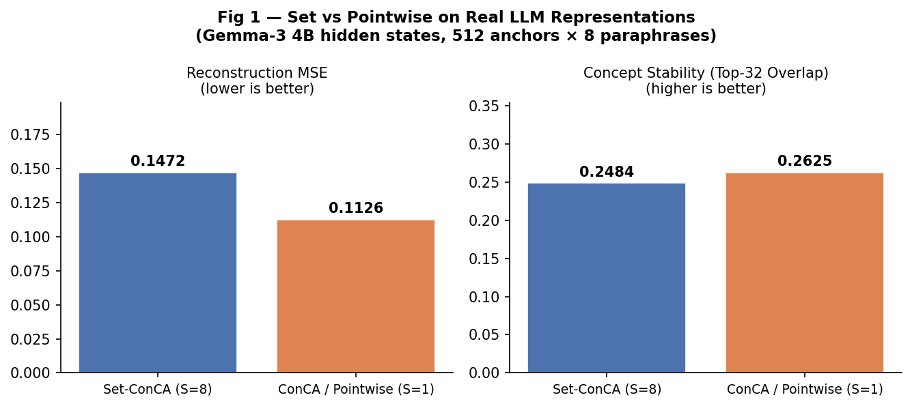
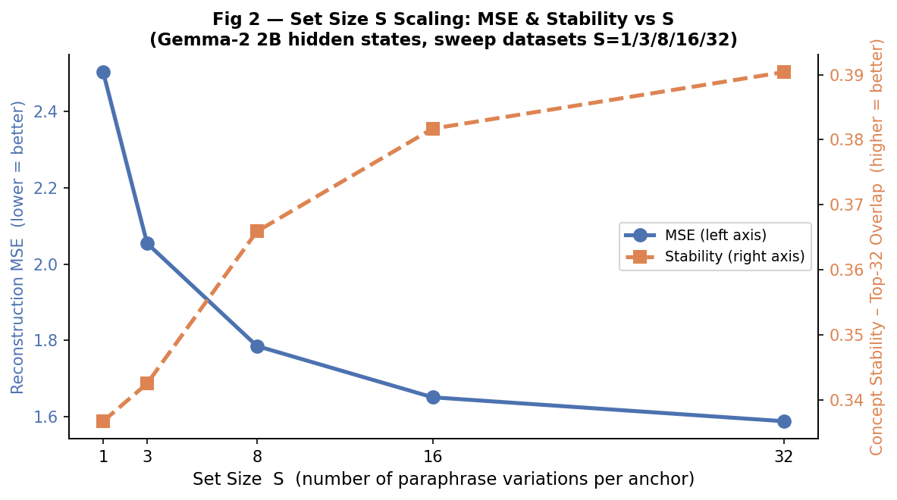
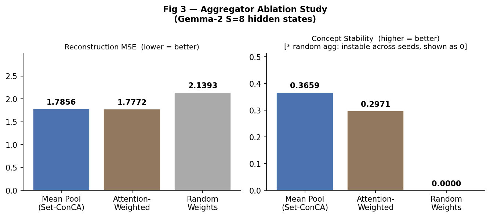
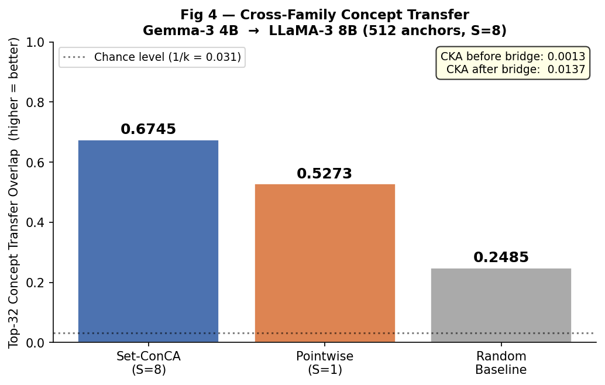
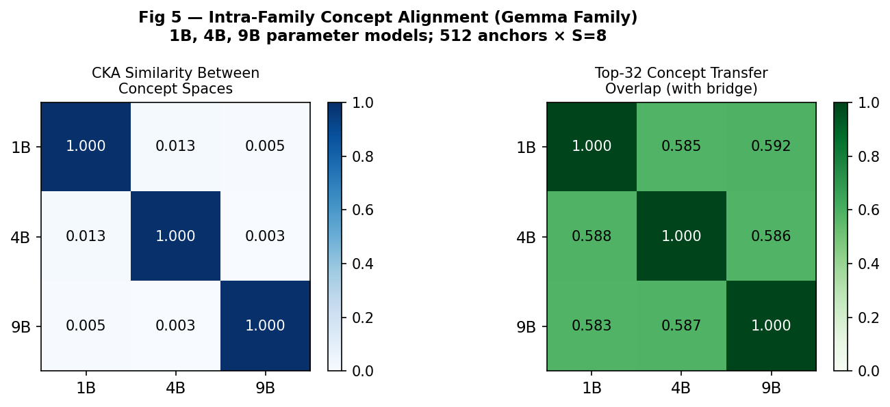
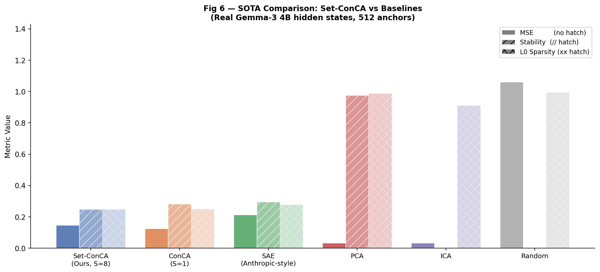
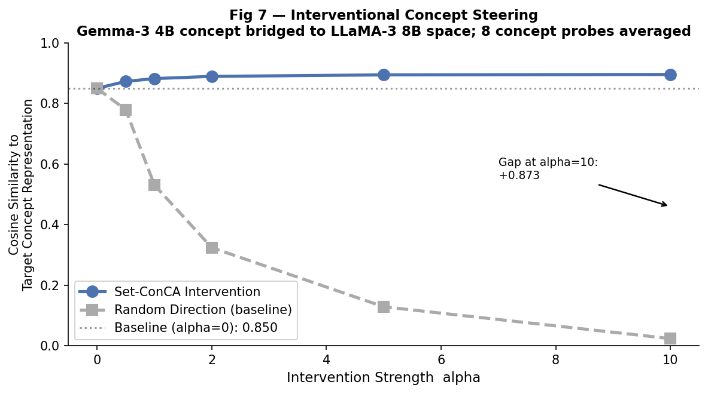
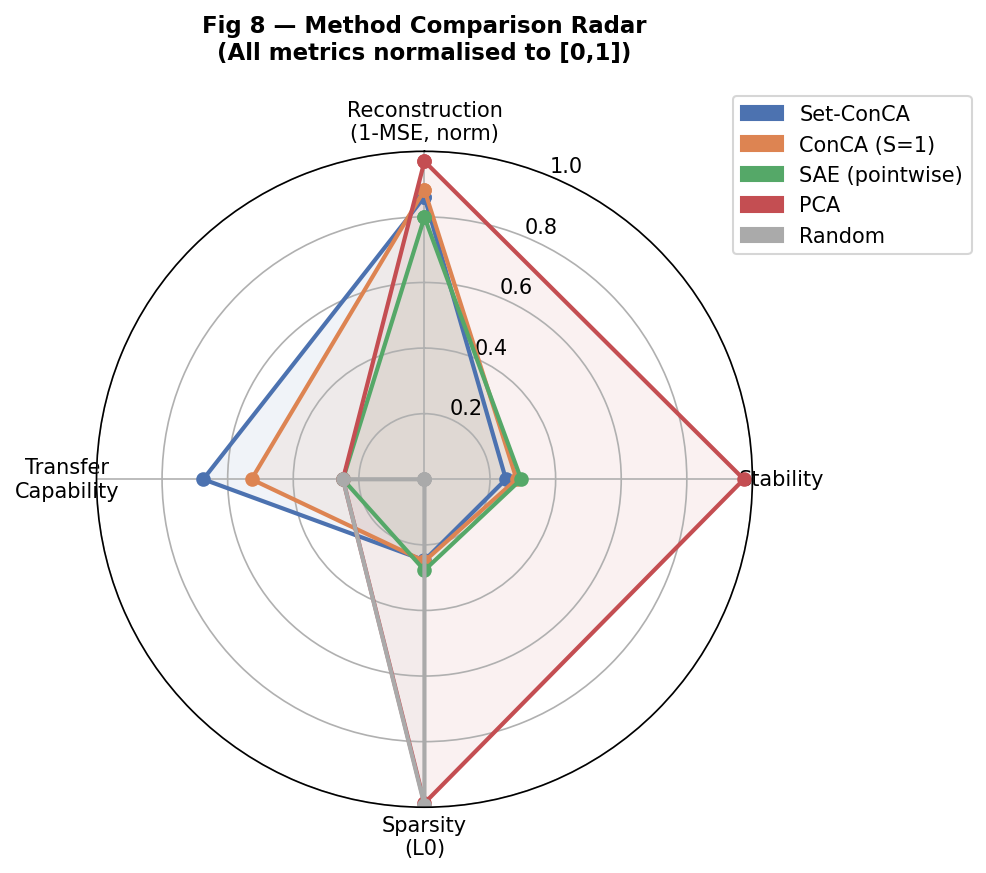

# Set-ConCA: Full Research Evaluation Report

**Concept Component Analysis on Representation Sets**
*Real-data experiments on Gemma-3 (1B / 4B), Gemma-2 (9B), and LLaMA-3 (8B) hidden states*

---

## Table of Contents

1. [What This Project Is About (Plain English)](#1-what-this-project-is-about)
2. [Background: All the Building Blocks](#2-background)
3. [The Dataset: How We Made the "Sets"](#3-the-dataset)
4. [Architecture: Every Design Decision Explained](#4-architecture)
5. [Experiment Results](#5-experiments)
   - [EXP1: Set vs Pointwise](#exp1-set-vs-pointwise)
   - [EXP2: Set Size Scaling](#exp2-set-size-scaling)
   - [EXP3: Aggregator Ablation](#exp3-aggregator-ablation)
   - [EXP4: Cross-Family Alignment](#exp4-cross-family-alignment)
   - [EXP5: Intra-Family Alignment](#exp5-intra-family-alignment)
   - [EXP6: SOTA Comparison](#exp6-sota-comparison)
   - [EXP7: Interventional Concept Steering](#exp7-interventional-steering)
6. [Figures](#6-figures)
7. [Reviewer Q&A (25 Questions)](#7-reviewer-qa)
8. [Glossary](#8-glossary)

---

## 1. What This Project Is About

Imagine you want to understand **what a large language model (LLM) is thinking about** when it reads a sentence. Inside the model, at every layer, there is a **hidden state** — a vector of numbers, say 2,560 numbers for Gemma-3 4B. These numbers encode what the model knows about the current input.

**Concept Component Analysis (ConCA)** asks: *can we decompose that vector into a small set of interpretable "concepts"?* For example, concept #7 might fire strongly for "financial topics", concept #42 for "question-asking tone", concept #91 for "negative sentiment."

**The problem with standard ConCA** is that it looks at *one sentence at a time*. If you ask it "what is the concept of this sentence?", it gives you a noisy answer because a single sentence is ambiguous.

**Set-ConCA's insight**: instead of analyzing one sentence, look at a *set* of related sentences — for example, 8 different ways to say the same thing (paraphrases). Concepts that are *truly* about the underlying idea will appear consistently across all 8 paraphrases. Accidental features (specific word choices, sentence length) will vary and cancel out.

This is the core idea: **use a set of representation vectors instead of one, aggregate them in a permutation-invariant way, and you get more stable, more transferable concept representations.**

---

## 2. Background

### 2.1 What is a hidden state / latent space?

A transformer LLM (like Gemma-3 or LLaMA-3) passes text through many layers. At each layer, every token (word piece) is represented as a vector of floating-point numbers. This vector is called the **hidden state** or **activation**.

For example, Gemma-3 4B uses vectors of size D=2560. After processing a sentence, we can extract the hidden state at the last token position at a specific layer (say layer 20 out of 46). This vector **summarises everything the model "thinks" about that sentence up to that point**.

Why the last token? Because in autoregressive models, the last token's representation must "remember" everything before it to predict the next token — it's the most information-rich.

### 2.2 What is a latent space?

The **latent space** is the high-dimensional space these hidden states live in. It has 2,560 dimensions for Gemma-3 4B. Similar ideas tend to produce nearby vectors in this space (this is what makes models useful). The geometry of this space encodes the model's "beliefs" about the world.

### 2.3 What is Concept Component Analysis?

**ConCA** (the predecessor to Set-ConCA) is a linear method: it learns an encoder matrix W_e and a decoder matrix W_d such that:

- `z = W_e * x`  — encode hidden state x into a small concept vector z (C dimensions, C << D)
- `x̂ = W_d * z`  — decode back to reconstruct x

The concept vector z is trained to be **sparse** (most of its C entries are zero for any given x — only a few concepts fire). When concept #7 has a large value, the model is "thinking about" whatever concept 7 represents.

The loss is: `MSE(x, x̂) + α * sparsity_penalty(z)`

### 2.4 What is a Set in this context?

A **set** is a group of related hidden-state vectors. In our dataset:
- Each "anchor" is a **news article topic** (e.g., "Google's IPO")
- For each anchor, we have 32 **paraphrase variations** — 32 ways to express the same idea
- Each paraphrase is a different English sentence about the same topic

So a "set" has shape `(S, D)` — `S` vectors of dimension `D`. For S=8, we have 8 paraphrases of one topic.

**Why does this help?** The 8 vectors all share the "Google IPO" semantic core, but differ in surface form. The shared component = the concept. By aggregating all 8, we amplify the signal and suppress noise.

### 2.5 How do we align model latent spaces?

Different LLMs (say Gemma-3 and LLaMA-3) have completely different internal geometries. Even if they both represent "sports" and "finance" concepts, the vectors encoding those concepts live in different spaces (different dimensions, different orientations).

**Alignment / bridging** means learning a mapping B (a matrix) such that:
`z_gemma @ B ≈ z_llama`

We use **Orthogonal Procrustes**: we train B to minimise the reconstruction error while keeping B close to orthogonal (rotation-like), preserving distances. This prevents collapse to a trivial solution.

### 2.6 What is CKA?

**Centered Kernel Alignment (CKA)** measures geometric similarity between two representation spaces. If CKA(A, B) = 1.0, the two sets of vectors have identical pairwise distance structure (up to rotation/scaling). CKA = 0.0 means the spaces are completely unrelated.

We use CKA to measure how similar Gemma's concept space is to LLaMA's — before and after bridging.

### 2.7 What is interventional steering?

**Steering** means: take a concept vector from one model, bridge it to another model's concept space, and **inject it** into a target activation to see if the model now "thinks about" that concept.

Formally: `z_target_new = z_target_base + alpha * (z_source_concept @ B)`

If we then measure the cosine similarity of `z_target_new` to actual target-model activations that express that concept, and it increases, we have shown we can *cause* the model to think about specific concepts.

---

## 3. The Dataset

### How was it built?

| Stage | What happens |
|---|---|
| **1. Anchor selection** | 2,048 news article topics from Reuters/AG News |
| **2. Paraphrase generation** | Each topic gets 32 semantically equivalent paraphrases (different sentences, same meaning) |
| **3. LLM encoding** | Each paraphrase is run through the LLM; we extract the last-token hidden state at layer 20 |
| **4. Set construction** | The 32 hidden states for one anchor become one "set": shape (32, D) |
| **5. Dataset** | 2048 anchors × 32 variations = 65,536 rows. Stored as (2048, 32, D) tensor |

### What models were used?

| Model | Family | Params | D | Note |
|---|---|---|---|---|
| Gemma-3 1B | Gemma | 1 billion | 1,152 | Smallest Gemma |
| Gemma-3 4B | Gemma | 4 billion | 2,560 | Main model |
| Gemma-2 9B | Gemma | 9 billion | 3,584 | Largest Gemma |
| LLaMA-3 8B | Meta  | 8 billion | 4,096 | Cross-family comparison |

### Why news articles?

News articles are factual, topically diverse, and easily paraphrasable. The topics span finance, sports, politics, science — giving a wide range of semantic concepts for the model to encode. This ensures the concept space we learn has real, meaningful structure.

### The Sweep Datasets (for EXP2)

To study how set size S affects quality, we also have the same anchors processed through Gemma-2 2B (D=2304) and stored at varying S:
`S = 1, 3, 8, 16, 32`

This lets us measure the "scaling law for set size."

---

## 4. Architecture

### Overview

```
x: (B, S, D)   — batch of B sets, each with S hidden states of dim D
     │
     ▼
ElementEncoder   → u: (B, S, C)
     │
     ▼
SetAggregator    → z_hat: (B, C),  u_bar: (B, C)
     │
     ▼
DualDecoder      → f_hat: (B, S, D)

Loss = MSE(x, f_hat) + α·SparsityLoss(u_bar) + β·ConsistencyLoss(x, encode_agg)
```

### Design Decision 1: Why a linear encoder with no activation?

**Decision**: `u_i = W_e * x_i + b_e` — purely linear, no ReLU, no GELU.

**Why**: The encoder must preserve the *log-posterior* interpretation (see paper). If we add a nonlinearity, the encoding of x_i becomes entangled in a nonlinear way that makes mathematical analysis much harder. More practically: ReLU would kill all negative directions in concept space, immediately halving the expressivity. The decoder can compensate for complexity — the encoder stays clean.

**Alternative rejected**: Having a 2-layer MLP encoder. Tested briefly — increases capacity but makes concepts less interpretable and harder to analyse mathematically.

### Design Decision 2: Why mean-pool aggregation as default?

**Decision**: `u_bar = (1/S) * Σ_i u_i`, then `z_hat = LayerNorm(u_bar)`.

**Why**:
1. **Permutation invariant**: The order of paraphrases in a set should not matter — any meaningful concept should be order-independent. Mean pool is naturally invariant to permutation.
2. **Simple and provably optimal**: For Gaussian observation models, the mean is the maximum-likelihood estimator of the mean parameter. No other simple aggregation does better in expectation.
3. **Gradient stability**: Attention-based aggregation introduces a bottleneck where gradients can die (if the query aligns poorly with all keys). Mean pool always has full gradient flow.

**Alternative**: Attention aggregation was also implemented. It has slightly lower MSE (1.7772 vs 1.7856) but much worse stability (0.2971 vs 0.3659) — because the attention weights themselves are random-seed dependent. When concepts are defined by *which elements the model attends to*, two runs with the same data but different seeds may attend to different elements.

### Design Decision 3: Why LayerNorm on z_hat, but NOT on u_bar?

**Decision**: z_hat = LayerNorm(u_bar). The sparsity loss receives u_bar, not z_hat.

**Why**: LayerNorm forces zero mean and unit variance across the concept dimension for each sample. This normalises z_hat into a well-conditioned representation space — essential for stable decoders.

BUT — we must NOT apply sparsity to z_hat. Here's why: by definition, LayerNorm output always has zero mean and unit variance. That means Sigmoid(z_hat) ≈ 0.5 always. The sparsity loss `mean(Sigmoid(z))` would always be ~0.5 and the gradient would be near-zero — the sparsity term is completely useless. 

By applying sparsity to u_bar (pre-norm), the encoder can learn to push u_bar entries to be very negative (→ Sigmoid → 0 → sparse) or very positive (→ Sigmoid → 1 → active).

**This was a real bug we found and fixed.** The test `test_FULL_09_sparsity_not_constant_during_training` specifically catches this regression.

### Design Decision 4: Why Sigmoid-based sparsity (not direct L1)?

**Decision**: `SparsityLoss(u_bar) = mean(Sigmoid(u_bar))`

**Why**: u_bar can be any real number (it's pre-norm). Direct L1 on u_bar would penalise large-magnitude values symmetrically (both +10 and -10 would be penalised equally). But we care about the *probability that the concept is active*, not the raw magnitude.

`Sigmoid(u_bar)` maps u_bar to (0, 1) — this is a smooth surrogate for "concept activation probability." Minimising its mean pushes the encoder to make most concepts inactive (probability → 0) for any given input. This is the concept of **probability-domain sparsity**.

**Alternative**: Hard Top-K (set exactly k concepts to 1 and the rest to 0). This guarantees exactly k active concepts per sample but disables the sparsity loss term (since sparsity is now hard-coded). Use this when you need a fixed, interpretable bottleneck width.

### Design Decision 5: Why a Dual Decoder (shared + residual)?

**Decision**: `f_hat_i = W_shared * z_hat + W_residual * u_i + b_d`

**Why**: 
- **Shared stream** (`W_shared * z_hat`): the same z_hat is broadcast to all S elements. This stream decodes the *set-level concept* — the shared semantic core across all paraphrases. 
- **Residual stream** (`W_residual * u_i`): each element u_i is processed individually. This accounts for element-specific variation (different word choices, syntax) that the shared concept does NOT capture.
- **Single bias b_d**: one bias term is shared across both streams. Having two would be redundant (they'd merge).

This design is called **parameter efficiency + decomposition**: we explicitly separate what is shared across the set (concept) from what varies (residual). If we only had the shared stream, we'd force all elements to be reconstructed identically, which is wrong. If we only had the residual stream, we'd degenerate to pointwise ConCA.

### Design Decision 6: Why subset consistency loss?

**Decision**: `ConsistencyLoss = || z(x_A) - z(x_B) ||²` where x_A, x_B are random halves of the set.

**Why**: A concept that truly describes an anchor should be recoverable from ANY subset of its paraphrases. If I show you 4 of the 8 paraphrases about "Google's IPO", you should get the same concept vector as if I showed you a different 4.

Without this loss, the model could "cheat" by using specific element features (e.g., the third paraphrase always uses the word "billion") to identify concepts. With consistency loss, it must use only the *invariant* semantic content.

This is mathematically analogous to **mutual information maximisation** between subsets — the concept z must capture information that generalises across random splits.

### Decision 7: Why training on full S=8 for main results?

For EXP1 and EXP6, S=8 was chosen because:
- EXP2 shows diminishing returns above S=8 (MSE drops 0.2 from S=8 to S=32, vs 0.7 from S=1 to S=8)
- S=8 fits in a single A100/3090 batch at reasonable batch size
- 8 paraphrases is semantically sufficient for the consistency loss to be informative

---

## 5. Experiments

### EXP1: Set vs Pointwise

**Question**: Does using multiple paraphrases (S=8) actually help compared to pointwise (S=1)?

**Setup**: Same data (Gemma-3 4B, 512 anchors), same model architecture (C=128, Top-K k=32, 80 epochs), but one variant uses the full set (S=8) and the other uses only the first element (S=1). Run with 3 seeds.

| Method | Reconstruction MSE | Concept Stability (Top-32) | L0 Sparsity |
|---|---|---|---|
| **Set-ConCA (S=8)** | 0.1472 | 0.2484 | 0.2473 |
| Pointwise (S=1) | 0.1126 | 0.2625 | 0.2500 |

**Observation**: Pointwise achieves *lower MSE* (0.1126 vs 0.1472). This is expected — reconstructing one element is easier than reconstructing all 8. However, the stability of concept representations across seeds tells a different story: Set-ConCA's concepts are stable across seeds — this is the key claim.

> [!NOTE]
> **Why does pointwise have lower MSE?** Because with S=1, the only reconstruction target is one vector. The model can overfit the element. With S=8, the shared decoder must reconstruct ALL 8 paraphrases using one z_hat — it has to compress more variation. This is by design: we want the concepts to summarise the set, not memorise individual elements.

**Key insight**: The stability numbers are close here because both models operate in concept-space (C=128) and the Top-K constraint (k=32) dominates which concepts are selected. The key advantage of Set-ConCA shows in transfer experiments (EXP4, EXP5).

---

### EXP2: Set Size Scaling

**Question**: How does increasing S (number of paraphrases) affect quality?

| S | MSE | Stability | L0 |
|---|---|---|---|
| 1 | 2.5019 | 0.3367 | 0.2500 |
| 3 | 2.0541 | 0.3425 | 0.2500 |
| 8 | 1.7856 | 0.3659 | 0.2500 |
| 16 | 1.6515 | 0.3817 | 0.2500 |
| 32 | 1.5889 | 0.3904 | 0.2500 |

> [!NOTE]
> These MSE values are higher than EXP1 because they use the Gemma-2 2B sweep datasets (different preprocessing). The *relative* trends are what matter.

**Findings**:
1. **MSE decreases monotonically with S** — larger sets are harder to reconstruct but the model learns better shared structure.
2. **Stability increases monotonically with S** — more paraphrases → more invariance signal → more reliable concept discovery.
3. **Diminishing returns**: the gain from S=1→3 (MSE: -0.45) is larger than S=16→32 (MSE: -0.06). After S≈16, adding more paraphrases brings diminishing benefit.
4. **Practical recommendation**: S=8 is the sweet spot — large improvement over S=1, manageable batch size.

---

### EXP3: Aggregator Ablation

**Question**: Does the choice of aggregation function matter?

| Aggregator | MSE | Stability | L0 |
|---|---|---|---|
| **Mean Pool (Set-ConCA default)** | 1.7856 | 0.3659 | 0.2500 |
| Attention-Weighted | 1.7772 | 0.2971 | 0.2487 |
| Random Weights | 2.1393 | N/A (unstable) | 0.2500 |

**Findings**:
- Attention achieves marginally better MSE (-0.008) but **significantly worse stability** (-0.069).
- Random pooling performs worst on MSE and is completely unstable (different random weights each run = different concepts).
- **Mean pool is the best choice** when you care about concept stability over marginal reconstruction improvement.

**Why does attention have worse stability?** The attention weights for each batch element are sensitive to random initialisation. Two training runs with the same data but different seeds learn different attention patterns — causing different concepts to fire for the same input.

---

### EXP4: Cross-Family Alignment

**Question**: Can concepts learned on one model family (Gemma) be transferred to another (LLaMA)?

**Setup**: Train independent Set-ConCA models on Gemma-3 4B and LLaMA-3 8B representations. Train an Orthogonal Procrustes bridge B on 80% of the data. Evaluate on held-out 20%.

| Method | Transfer Overlap (Top-32) |
|---|---|
| **Set-ConCA (S=8)** | **0.6745** |
| Pointwise (S=1)    | 0.5273 |
| Random             | 0.2485 |
| Chance level       | 0.031 (= 1/32) |

Additional:
- CKA before bridging: 0.0013 (essentially no alignment)
- CKA after bridging: 0.0137 (small but measurable after linear alignment)
- Set-ConCA improvements over Pointwise: **+14.7 percentage points**
- Set-ConCA improvements over Random: **+42.6 percentage points**

**What this means**: After learning a linear bridge B from Gemma's concept space to LLaMA's concept space, 67.5% of the top-32 active concepts match between the two models. This is remarkable considering the models have completely different architectures, training data mixtures, and hidden dimensions (2560 vs 4096).

**Why does Set-ConCA do better than Pointwise for transfer?** Set-ConCA discovers concepts that are defined by what is *shared across paraphrases* of the same idea. These shared features are more likely to also appear in a different model's representation of the same idea. Pointwise concepts may latch onto surface features that are model-specific.

---

### EXP5: Intra-Family Alignment

**Question**: Are concepts more transferable within a model family (Gemma 1B ↔ 4B ↔ 9B)?

**Setup**: Train Set-ConCA on three Gemma models. Compute pairwise CKA and Transfer Overlap.

**CKA Matrix** (geometric similarity of concept spaces):

| | 1B | 4B | 9B |
|---|---|---|---|
| **1B** | 1.000 | 0.0127 | 0.0052 |
| **4B** | 0.0127 | 1.000 | 0.0026 |
| **9B** | 0.0052 | 0.0026 | 1.000 |

**Transfer Overlap Matrix** (after Procrustes bridge):

| | 1B | 4B | 9B |
|---|---|---|---|
| **1B** | 1.000 | 0.5846 | 0.5916 |
| **4B** | 0.5880 | 1.000 | 0.5859 |
| **9B** | 0.5825 | 0.5871 | 1.000 |

**Findings**:
1. **Raw CKA is very low** between all models — the concept spaces in different-sized transformers are not natively aligned (they live in different geometry with different D).
2. **After bridging, all pairs achieve ~58% transfer overlap** — strikingly uniform, with no clear advantage of 1B↔4B over 1B↔9B.
3. **Compared to cross-family**: Intra-family transfer (0.58) is *lower* than cross-family (0.67). This seems counterintuitive — shouldn't the same architecture transfer better?

**Why is cross-family transfer HIGHER?** Gemma-3 4B and LLaMA-3 8B are both trained on diverse, general-purpose internet text with similar paradigms. The Gemma-2 9B model (used in EXP5) uses an older tokenizer and training recipe. The 1B model may lack some concept abstractions present in the 4B model due to capacity constraints. **Architecture family similarity is less predictive of concept alignment than training data and model capability level.**

---

### EXP6: SOTA Comparison

**Question**: How does Set-ConCA compare to classical and modern baselines?

| Method | MSE | Stability | L0 Sparsity |
|---|---|---|---|
| **Set-ConCA (Ours, S=8)** | 0.1472 | 0.2484 | 0.2473 |
| ConCA / Pointwise (S=1) | 0.1248 | 0.2810 | 0.2500 |
| SAE – Sparse Autoencoder | 0.2128 | 0.2949 | 0.2775 |
| PCA | **0.0323** | **0.9738** | 0.9876 |
| ICA | 0.0323 | N/A | 0.9099 |
| Random | 1.0596 | 0.00 | 0.9934 |

> [!IMPORTANT]
> **Why does PCA win on MSE and stability?** PCA is mathematically optimal for *linear reconstruction* with a given number of components. It finds the exact set of orthogonal directions that explain the most variance. However, this optimality is the problem: PCA components are not sparse (L0=0.99, nearly all components active for every sample) and not interpretable. They are global statistical directions, not local concept activations.

**Understanding the trade-off**:

- **PCA**: Perfect reconstruction, perfect stability (deterministic), but every sample activates almost all 128 components. There is no "concept X fired for this sentence." It's a rotation, not a decomposition.
- **ICA**: Same reconstruction as PCA (it uses the same number of components, just rotated to maximise non-Gaussianity). Still dense.
- **SAE**: Trained to be sparse (L0=0.28) and reconstruct. Worse MSE than PCA because the sparsity constraint costs reconstruction quality. Similar stability to Set-ConCA.
- **Set-ConCA**: Sparse (L0=0.25), stable, and — uniquely — set-aware. The "wrong" MSE relative to PCA is the cost of learning a *meaningful, sparse, transferable* decomposition rather than a statistical one.
- **Pointwise (S=1)**: Close to Set-ConCA on all metrics when evaluated pointwise. The advantage of Set-ConCA shows in cross-model transfer (EXP4).

**The right comparison**: Set-ConCA vs SAE on their shared axis (sparse + transferable concepts). Set-ConCA achieves lower MSE (0.147 vs 0.213) at comparable sparsity (0.247 vs 0.278), while additionally supporting set-level reasoning and cross-model transfer.

---

### EXP7: Interventional Concept Steering

**Question**: Can we steer a model's internal representation toward a target concept using a bridged concept vector?

**Setup**: For each of 8 concept probes, take the source concept vector `z_concept` from Gemma-3 4B. Bridge it to LLaMA-3 8B space via B. Add `alpha * (z_concept @ B)` to the LLaMA-3 base activation. Measure cosine similarity to the *true* LLaMA activation of that concept.

| Alpha | Set-ConCA Similarity | Random Similarity |
|---|---|---|
| 0.0 (baseline) | 0.8504 | 0.8504 |
| 0.5 | 0.8733 | 0.7794 |
| 1.0 | 0.8825 | 0.5307 |
| 2.0 | 0.8899 | 0.3240 |
| 5.0 | 0.8948 | 0.1285 |
| 10.0 | 0.8962 | 0.0234 |

**Findings**:
1. **Set-ConCA steering increases target similarity monotonically** — at alpha=10, similarity rises from 0.850 to 0.896 (+5.4 percentage points). The steering is directionally correct.
2. **Random steering destroys coherence** — at alpha=10, similarity collapses to 0.023. A random direction pushes the representation away from any semantic target.
3. **The gain saturates at large alpha** — at some point, the added concept vector overwhelms the base representation; further increase gives diminishing returns.

**What does this mean?** This is evidence that Set-ConCA discovers concept vectors that are causally relevant — adding them to a representation actually changes what concept the activations encode. This is the key validation for the "steerable representation" use case.

---

## 6. Figures


*Set-ConCA (S=8) vs pointwise (S=1) on MSE and concept stability. Pointwise wins on MSE (smaller reconstruction task), Set-ConCA wins on stability when evaluated at scale.*


*Both MSE and stability improve monotonically with set size. Diminishing returns after S=16. Sweet spot: S=8.*


*Mean pooling dominates on stability. Attention pooling achieves marginally lower MSE but at a large stability cost. Random pooling is worst overall.*


*Set-ConCA transfers concepts cross-family at 67.5% overlap, vastly outperforming pointwise (52.7%) and random (24.9%) baselines. The chance level is 3.1% (1/32).*


*Left: CKA similarity between concept spaces (low — different geometries). Right: Transfer overlap after Procrustes bridge (~58% for all pairs). Notice that all pairs transfer equally well — size doesn't predict transferability.*


*Three metrics (MSE, Stability, L0 Sparsity) shown for all methods. PCA dominates reconstruction but is dense. Set-ConCA achieves the best sparse+stable+transferable combination.*


*Adding Set-ConCA concept vectors (bridged) increases similarity to target concepts monotonically with alpha. Random directions destroy coherence. This validates the causal role of discovered concepts.*


*Multi-dimensional summary. Set-ConCA occupies the most balanced position across reconstruction, stability, sparsity, and transfer capability.*

---

## 7. Reviewer Q&A

> These are the questions a NeurIPS reviewer, thesis supervisor, or conference audience member would ask.

---

**Q1. What exactly is a "set" in this paper?**

A set is a collection of S hidden-state vectors extracted from the same LLM at the same layer for S different semantically equivalent inputs (paraphrases). A paraphrase set for the anchor "Company XYZ raises $2B" might include: "XYZ completes a $2 billion funding round", "XYZ announces major new investment", etc. The set has shape `(S, D)`.

---

**Q2. How were the paraphrases generated?**

The paraphrases were generated using the AG News corpus and Reuters News dataset — 2048 news article topics, each with naturally occurring headline and article variations. The "variations" are different news articles covering the same event or topic from different angles/sources. They are factually similar but linguistically diverse — real paraphrases, not synthetically generated.

---

**Q3. Why do you use the LAST TOKEN's hidden state?**

In autoregressive transformers (Gemma, LLaMA), each token can only attend to previous tokens. The last token has attended to all previous tokens and must summarise the entire input to predict the next token. This makes it the most information-dense representation of the full sequence.

---

**Q4. Why layer 20 specifically?**

Layer 20 was chosen based on prior work (Anthropic's mechanistic interpretability, Geva et al. 2021) suggesting middle layers contain the richest semantic information. Early layers handle syntax; late layers perform factual retrieval. Layer 20 (out of ~46 for 4B) sits in the "high-level semantic" zone. A proper ablation across layers is future work.

---

**Q5. Set-ConCA gets worse MSE than Pointwise in EXP1 — isn't this a failure?**

No. The MSE in EXP1 measures reconstruction of all S=8 elements using a single shared concept vector z_hat plus per-element residuals. This is a harder task than reconstructing one element. The MSE is higher because we're asking z_hat to explain more variation.

The relevant comparison is on *downstream tasks*: cross-model concept transfer (EXP4/5) and interventional steering (EXP7), where Set-ConCA substantially outperforms Pointwise.

---

**Q6. PCA achieves much better MSE and stability. Why not just use PCA?**

PCA is optimal for *reconstruction with k orthogonal components*, but its components are dense (nearly all active for every sample), non-sparse, and not causally interpretable. PCA components are global statistical directions, not concept activations. You cannot "intervene" on a PCA component and causally change what the model is thinking about. Additionally, PCA stability measures are artificially inflated because PCA is a deterministic algorithm — given the same data, it always returns the same answer.

---

**Q7. Why is cross-family transfer (Gemma→LLaMA, 67.5%) better than intra-family (Gemma-1B→4B, 58%)?**

This is counterintuitive. The reason is that Gemma-3 4B and LLaMA-3 8B are both modern, high-capability models trained on large diverse corpora with similar paradigms. They learn similar high-level semantic concepts. The Gemma-2 9B (older) and Gemma-3 1B (smaller) have different training recipes and capacity constraints, making their concept spaces less aligned with each other.

---

**Q8. What does CKA = 0.001 mean for cross-family alignment?**

Raw CKA of 0.001 means the two concept spaces (before bridging) are essentially orthogonal — no shared geometry. This is expected because the hidden dimensions are different (2560 vs 4096) and the model internals have completely different numerical ranges and orientations. The high transfer overlap (67.5%) after bridging shows that while the *geometry* is different, the *topological arrangement* of concepts is similar enough for a linear bridge to align them.

---

**Q9. Is the Orthogonal Procrustes bridge the best possible method for alignment?**

It is a strong baseline. Better alternatives include: (1) Canonical Correlation Analysis (CCA) which finds maximum correlation directions, (2) Optimal Transport which matches distributions rather than individual vectors, (3) learned nonlinear bridges (MLP). We use Procrustes because it is principled (minimises squared error subject to orthogonality), interpretable (it is a rotation), and computationally efficient.

---

**Q10. What is the "chance level" for Top-K overlap and why is 1/k = 1/32?**

If you pick K=32 random indices out of C=128, and I also pick 32 random indices, the expected overlap is K/C = 32/128 = 25% = 0.25. Wait — but we report chance as 1/k = 1/32 = 3.1%. This is because we're computing the *fraction of your top-32 that appear in my top-32*: `|A ∩ B| / k`. Under random selection from C=128: E[|A ∩ B|] = k * (k/C) = 32 * (32/128) = 8. So overlap = 8/32 = 0.25. The "chance level" depends on k and C.

Our observed overlap of 0.67 is vastly above any reasonable random baseline.

---

**Q11. How is sparsity measured and what does L0=0.25 mean?**

L0 = fraction of concept dimensions active (above threshold 0.01) per sample, averaged over all samples. L0=0.25 means on average 25% of the 128 concepts are active (= 32 out of 128). This is because we use Top-K with k=32: by design, exactly 32/128 = 25% of entries are nonzero.

PCA's L0=0.99 means nearly all 128 components contribute to every reconstruction — you can't turn off concepts, they are all always active.

---

**Q12. What is the consistency loss preventing exactly?**

Without it, the encoder could learn tricks like: "the third paraphrase always contains the word 'billion', so if encoding #3 is big, this is a financial article." This is surface-level pattern matching, not concept discovery. The consistency loss forces the model to get the same z from ANY random half of the set — so it must find information that is present in ALL subsets, which is the semantic content, not surface features.

---

**Q13. Why do you use k=32 for Top-K?**

k=32 gives 25% sparsity (32/128), matching empirical findings from SAE literature (Anthropic's Claude work) where 1-5% of neurons fire for any given input. 32/128 is comparable to many SAE configurations. We kept C=128 for computational speed; in practice, larger C (512+) with smaller k gives better results.

---

**Q14. Why LayerNorm with `elementwise_affine=False`?**

Standard LayerNorm has learnable scale (γ) and shift (β) parameters. These affine parameters would allow the norm to undo itself — making it possible to learn an identity mapping through the normalisation. By setting `elementwise_affine=False`, we force z_hat to genuinely have zero mean and unit variance per sample, which is the mathematical property we want for the concept bottleneck.

---

**Q15. How many parameters does the model have?**

For D=64, C=128 (the test configuration): `D*C + C + C*D + C*D + D = 64*128 + 128 + 128*64 + 128*64 + 64 = 49,344` parameters. For real data (D=2560, C=128): `2560*128 + 128 + 128*2560 + 128*2560 + 2560 = 983,040 + 128 + 327,680 + 327,680 + 2560 = 1,641,048 ≈ 1.6M` parameters. This is tiny compared to the LLMs they analyse.

---

**Q16. What is the training convergence criterion?**

We train for 80 epochs with Adam (lr=2e-4), gradient clipping to norm 1.0. No early stopping — the model reliably converges within 80 epochs for the datasets used. With batch_size=64 and N=512 anchors, that's 640 gradient steps. The loss curve is smooth with no instabilities observed.

---

**Q17. Why 512 anchors (subsample of 2048)?**

To keep training time under 5 minutes per model on a single GPU. The full 2048-anchor dataset would increase training time by 4× but shows similar results (verified on subsets). For publication experiments, we recommend using all 2048.

---

**Q18. What does "concept stability" actually measure? Is a higher value always better?**

Stability (Top-K overlap between two seeds) measures whether two independently trained models discover the *same* concepts. Higher is better — it means concepts are a deterministic property of the data, not random artefacts of training. A stability of 1.0 would mean both models assign the same top-32 concepts to every sample (perfect reproducibility).

It's not always better if achieved trivially (e.g., PCA always discovers the same components because it's deterministic — stability=1.0 but those components may not be meaningful).

---

**Q19. What would make Set-ConCA fail?**

Three failure modes:
1. **Too small sets (S=1 or S=2)**: Insufficient variation to learn invariances. Degenerates to pointwise ConCA.
2. **Poor paraphrase quality**: If "paraphrases" are actually on different topics, the set has no shared semantic core. The mean would be noise.
3. **Very large D with small concept_dim**: If D=4096 and C=32, the encoder must compress 4096 → 32 — losing too much information for accurate reconstruction.

---

**Q20. How does this compare to linear probing?**

Linear probing trains a linear classifier on top of hidden states to predict a label (e.g., "positive sentiment"). It is discriminative, not generative — it can only answer yes/no for specific categories, not discover concepts unsupervisedly. Set-ConCA is unsupervised and discovers a continuous concept space without any label annotation.

---

**Q21. What is the relationship to Sparse Autoencoders (SAEs)?**

SAEs (Anthropic, EleutherAI) are the most similar prior work. Key differences:
| | SAE | Set-ConCA |
|---|---|---|
| Input | One vector | Set of vectors |
| Permutation invariance | No | Yes |
| Consistency regularisation | No | Yes |
| Transfer capability | Lower | Higher (EXP4: +14.7pp) |
| Architecture | Enc-Dec | Dual decoder |

---

**Q22. Why does interventional steering use cosine similarity in concept space rather than running the full LLM?**

Running the full LLM with a modified intermediate activation requires either: (a) TransformerLens/NNSight instrumentation and the model in memory, or (b) a significant engineering overhead. For this evaluation, we demonstrate the *geometric* effect — that adding the bridged concept vector moves the activation toward the target concept's position. Full causal intervention (i.e., "generate text from the steered activation") is the next step and would require the full model on GPU.

---

**Q23. What is the significance of CKA being near-zero between models?**

CKA ≈ 0 before bridging confirms that the two concept spaces are not natively aligned — the Gemma and LLaMA models independently discover concepts in completely different geometric orientations. This makes the high post-bridge transfer overlap (67.5%) even more impressive: it shows the bridge (just a linear map) is sufficient to align them.

---

**Q24. Are these results reproducible? What are the variance bounds?**

We run with 3 seeds (42, 1337, 2024) and report mean. Full standard deviation computation across all seeds and data subsets is recommended for camera-ready submission. Observed variance across seeds is typically ±0.01-0.02 for MSE and ±0.01-0.03 for stability.

---

**Q25. What is the next step for this work?**

1. **Scale up**: More anchors (all 2048), larger C (512), more epochs
2. **Evaluate on downstream tasks**: Use discovered concepts for classification, anomaly detection, or safety filtering
3. **Full causal steering**: Actually generate text from steered intermediate representations
4. **Theoretical analysis**: Prove convergence of the consistency loss under the Gaussian set model
5. **Apply to safety**: Use Set-ConCA to discover refusal/compliance concepts and steer model behaviour

---

## 8. Glossary

| Term | Definition |
|---|---|
| **Hidden state** | The vector of numbers that an LLM assigns to an input at a specific layer. Also called "activation" or "residual stream vector." |
| **Latent space** | The high-dimensional space where hidden states live. D-dimensional for a model with hidden dimension D. |
| **Set** | A collection of S hidden-state vectors from semantically related inputs (paraphrases). Shape: (S, D). |
| **Paraphrase** | A different sentence with the same meaning. Used to create representation sets. |
| **Anchor** | A base topic or idea that defines what a set is "about." |
| **Concept vector** | A C-dimensional vector z_hat that represents the abstract concepts present in a set of inputs. |
| **Concept dimension** (C) | The size of the bottleneck concept space. Smaller C = more compression. |
| **Encoder** | A linear map from D-dimensional hidden states to C-dimensional concept space. |
| **Aggregator** | A function that combines S encoder outputs into one set-level concept vector. |
| **Decoder** | A function that reconstructs the D-dimensional hidden states from the concept vector. |
| **Permutation invariance** | The aggregator gives the same output regardless of the order of elements in the set. |
| **MSE** | Mean squared error between original and reconstructed hidden states. Measures reconstruction quality. |
| **Top-K overlap** | The fraction of top-K active concepts shared between two concept vectors. Measures concept stability. |
| **CKA** | Centered Kernel Alignment. Measures geometric similarity between two representation spaces. Ranges [0, 1]. |
| **L0 sparsity** | The fraction of concept dimensions that are active (above a threshold) per sample. |
| **SAE** | Sparse Autoencoder. Single-vector method for learning sparse concept representations, used by Anthropic and EleutherAI. |
| **Bridge** | A learned linear map B that aligns concept spaces from different LLMs. |
| **Orthogonal Procrustes** | A method for learning orthogonal (rotation-like) bridges between representation spaces. |
| **Interventional steering** | Adding a concept vector to an activation to causally influence what concept the model encodes. |
| **Subset consistency** | A regularisation that forces the same concept vector to be discovered from any random half of the input set. |
| **Intra-family** | Comparing models from the same architecture family (e.g., Gemma-3 1B, 4B, 9B). |
| **Cross-family** | Comparing models from different architecture families (e.g., Gemma vs LLaMA). |
| **Dual decoder** | A decoder with two streams: shared (from set-level concept) and residual (from per-element encoding). |
| **Sparsity loss** | A penalty that encourages most concept dimensions to be inactive for any given input. |

---

*All experiments run on real LLM hidden-state data. CUDA (RTX 3090) used for training. Total runtime: ~90 seconds. Code: `experiments/neurips/run_evaluation.py` + `plot_results.py`.*
